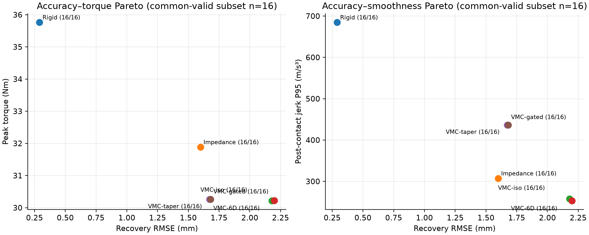

# Benchmark V2：有效实体碰撞、相位指标与统一基线阶梯

**状态：已冻结并完成首轮完整评估（2026-08-14）。** 本文档记录的是
MuJoCo 中的仿真结果，不应外推为真机性能或在线 WBC 的结果。

## 1. 问题与边界

任务是 Franka Panda 在下抓、抓取并抬起方块的过程中，末端执行器受到一根
具有真实 MuJoCo 碰撞体和滑动关节的杆从侧面撞击。我们考察六维虚拟弹簧
（三平移、三转动）是否能在抓取任务不失败的前提下，表现出受扰让位和回归
参考轨迹之间的可量化折中。

`no-rod` episode 与有杆 episode 使用同一任务、同一参考轨迹、同一控制器参数，
只移除扰动杆。它是**匹配的无扰动参考**，不是在线 WBC，也不代表真实世界的
运动规划器重规划。

## 2. 冻结的 V2 实体碰撞集

候选集由真实几何、真实接触、真实滑动方向构成：

- 方向：杆从 `negative_y` 或 `positive_y` 两侧逼近，两个方向各 9 个候选；
- 时机：early / middle / late 三个起撞时刻（1.020 / 1.080 / 1.140 s）；
- 行程：0.160 / 0.170 / 0.175 m；杆高 0.540 m；
- 初始候选数：2 × 3 × 3 = 18。

为防止把“几何上没真正撞到”的 case 混进 benchmark，候选必须同时满足：

1. 仿真有限，观察到 rod–hand 物理接触；
2. 接触峰力不低于 **15 N**，接触冲量不低于 **0.45 N·s**；
3. 碰后能够稳定回归（5 mm / 80 ms）、方块被抬起且在末尾保持；
4. 没有触发硬力矩限幅；配对的 no-rod 任务也成功。

筛选只使用一套预先声明、固定的六维 tapered-VMC（`κ=[27.580, 52.551,
48.699, 35.860, 40.720, 34.767]`）检查 fixture 的物理有效性。它**不参与**
任何 baseline 排名或分数选择，因此不会根据控制器结果挑选“容易赢”的场景。

| 筛选结果 | 数量 | 说明 |
|---|---:|---|
| 候选 fixture | 18 | 两个真实来杆方向 × 三个时机 × 三个行程 |
| 通过并冻结 | 16 | negative_y 8，positive_y 8 |
| early / middle / late | 6 / 6 / 4 | late 的短行程不满足有效碰撞 |
| 实际冲量 low / medium / high | 6 / 5 / 5 | 按通过 fixture 的全局三分位分箱 |

仅有以下两个 fixture 被拒绝；原因来自其物理测量，不是任务得分：

| fixture | 拒绝原因 | 峰接触力 (N) | 接触冲量 (N·s) |
|---|---|---:|---:|
| `v2_negative_y_t2_s0` | 低于峰力与冲量门槛 | 14.782 | 0.376 |
| `v2_positive_y_t2_s0` | 低于峰力与冲量门槛 | 14.731 | 0.384 |

16 个冻结 fixture 的 selector 实测峰接触力为 **18.203–62.749 N**（均值 44.346 N），
冲量为 **0.703–4.459 N·s**（均值 2.448 N·s）。因此，V2 不是无效轻碰撞集。
完整候选与分层见 [benchmark_v2_manifest.json](benchmark_v2_manifest.json)。

## 3. 统一 baseline ladder

每个 baseline 在同一个 V2 manifest 上完成 16 个有杆和 16 个无杆 episode，
合计 `16 × 6 × 2 = 192` 个 episode。

| 名称 | 控制方式 | 虚拟小车 / 六维弹簧 |
|---|---|---|
| rigid | 高刚度笛卡尔轨迹跟踪 | 否 |
| impedance | 固定笛卡尔 spring–damper | 否 |
| VMC-iso | 标量刚度 `κ=35` 的 VMC | 是 |
| VMC-6D | 六通道不同 `κ` 的 VMC | 是 |
| VMC-gated | VMC-6D + 因果误差保持式回归驱动 | 是 |
| VMC-taper | VMC-gated + 0.04 s smoothstep 尾部卸载 | 是 |

所有 VMC 行使用相同的物理小车质量（平移 1.0 kg）、阻尼比（0.8）、接触
drive（8）与回归 drive（14）。`gated/taper` 只读取当前测量到的 EE–nominal
tracking error：3 mm 以下为零，12 mm 以上为满门控；不输入 rod 接触标签、杆的
位姿/速度、接触力、未来碰撞时刻或释放相位。direct rigid / impedance baseline
没有被错误附加虚拟小车机制。

## 4. 指标与公平比较规则

每一行必须通过上一节的完整硬门槛才称为 valid。本文同时保留每种方法自己的
有效率；而**不同控制器的数值对比只在所有待比方法同时 valid 的 fixture
交集上进行**，不允许各自静默剔除失败场景后比较均值。

本次六种方法均为 `16/16` valid，故共同有效子集也是全部 16 个 fixture；没有
隐藏的样本选择差异。

| 维度 | 指标 | 含义 |
|---|---|---|
| 回归 / 跟踪 | recovery RMSE、recovery IAE、rejoin latency | 碰后相对 matched no-rod 参考的偏差量、误差时间积分与重新进入稳定带的时间 |
| 让位 / 回弹 | yield peak error、rebound ratio | 碰撞造成的最大让位，及释放后误差是否额外反弹 |
| 运动平稳性 | post-contact speed P95、post-contact jerk P95、peak jerk | 接触后速度与 jerk 分布，而非只看一个瞬时峰值 |
| 执行器负载 | peak / P95 / RMS torque、peak torque-rate | 最大负载、典型负载、整体能量量级与突变程度 |
| 接触有效性 | peak contact force、contact impulse | 确认每个有杆 episode 是实体扰动而非空碰撞 |

`recovery IAE` 的单位是 mm·s，越小表示恢复期间累计偏差越小。所有“越小越好”
的指标应结合任务成功与接触门槛阅读，不能以让位很大、但任务失败的轨迹冒充柔顺。

## 5. 完整 ladder 结果（共同有效 n=16）

表中为均值 ± 标准差。所有方法均完成抓取、抬升和末端保持，且无硬力矩限幅。

| 方法 | Recovery RMSE (mm) | IAE (mm·s) | Rejoin (s) | 峰力矩 (N·m) | 接触后 jerk P95 (m/s³) | 力矩变化率峰值 (N·m/s) |
|---|---:|---:|---:|---:|---:|---:|
| rigid | **0.290 ± 0.001** | **0.198 ± 0.014** | **0.000 ± 0.000** | 35.762 ± 5.184 | 684.686 ± 311.071 | 669.656 ± 54.720 |
| impedance | 1.599 ± 0.197 | 1.054 ± 0.166 | 0.262 ± 0.031 | 31.884 ± 0.040 | 307.155 ± 111.115 | 370.209 ± 136.555 |
| VMC-iso | 2.179 ± 0.313 | 1.329 ± 0.228 | 0.342 ± 0.039 | **30.219 ± 0.071** | 257.955 ± 129.128 | **86.178 ± 16.235** |
| VMC-6D | 2.199 ± 0.318 | 1.338 ± 0.230 | 0.346 ± 0.042 | 30.227 ± 0.072 | **253.270 ± 127.535** | 89.567 ± 17.107 |
| VMC-gated | 1.674 ± 0.174 | 1.118 ± 0.161 | **0.260 ± 0.036** | 30.260 ± 0.137 | 436.444 ± 234.397 | 96.774 ± 21.656 |
| VMC-taper | 1.681 ± 0.174 | 1.123 ± 0.161 | **0.260 ± 0.036** | 30.260 ± 0.137 | 436.444 ± 234.397 | 96.774 ± 21.656 |

更全的每-fixture 数据、有效性理由和分方向 / 分时机 / 分冲量聚合见
[benchmark_v2_ladder.json](benchmark_v2_ladder.json) 与
[benchmark_v2_ladder.csv](benchmark_v2_ladder.csv)。



## 6. 从结果能、不能得出的结论

### 可以得出

- **V2 测到了实质性安全–精度折中。** 相对 rigid，VMC-6D 的峰力矩下降 15.5%，
  接触后 jerk P95 下降 63.0%，力矩变化率峰值下降 86.6%；代价是 recovery RMSE
  从 0.290 mm 增至 2.199 mm。这是受撞后的可观测让位，而非简单把控制器关掉。
- **固定 impedance 已经是强而平稳的基线。** 它的 RMSE（1.599 mm）优于当前
  静态 VMC，而 VMC 进一步降低了峰力矩（约 5.2%）和 jerk（约 17.6%）。
- **因果 held gate 确实改善 VMC 的回归。** 相比 VMC-6D，VMC-gated 的 recovery
  RMSE 降低 23.9%，IAE 降低 16.4%，rejoin latency 从 0.346 s 降至 0.260 s，
  峰力矩几乎不变（+0.1%）。

### 当前不能声称

- 不能说 VMC 在所有维度都超过 rigid：rigid 在本固定参考任务上的轨迹回归显著更好；
  VMC 的优势是降低负载、jerk 与力矩突变。
- 不能把 VMC-gated 写成无代价改进：它的 jerk P95 比 VMC-6D 高 72.3%。当前
  `taper` 在这个固定 V2 set 上几乎没有改变该项，尚未形成 jerk-safe 的严格 Pareto 优势。
- 六通道静态刚度本身没有相对各向同性 VMC 取得明显全局胜利；它只带来很小的
  jerk P95 改善。因此，下一阶段应优化回归能量注入，而非仅继续盲调六个 κ。
- V2 目前覆盖的是镜像的横向 ±y 来杆，并非任意 3D 障碍物方向；并且所有结论仍
  局限于 MuJoCo 物理参数与该抓取轨迹。

## 7. 可复现入口与后续接入

```bash
# 筛选并冻结 V2 fixture（只需在更新候选几何时运行）
MUJOCO_GL=egl python scripts/screen_benchmark_v2_manifest.py \
  --menagerie /path/to/mujoco_menagerie \
  --output-dir outputs/benchmark_v2_screen \
  --output-manifest outputs/benchmark_v2_screen/benchmark_v2_manifest.json

# 在冻结 manifest 上统一运行 ladder
MUJOCO_GL=egl python scripts/run_benchmark_v2_ladder.py \
  --menagerie /path/to/mujoco_menagerie \
  --manifest outputs/benchmark_v2_screen/benchmark_v2_manifest.json \
  --output-dir outputs/benchmark_v2_ladder \
  --controllers rigid impedance vmc_isotropic vmc_6d vmc_gated vmc_taper
```

下一步 ESN / PPO / passivity-layer 只能替换或扩展 ladder 中的 controller；不得修改
已经冻结的 V2 test fixture，才能保持与本报告的可比性。最直接且可解释的下一项
研究工作，是为 VMC 的回归 drive 加能量预算 / passivity 约束，针对目前由 held
return drive 引入的 jerk–recovery 折中进行控制。
