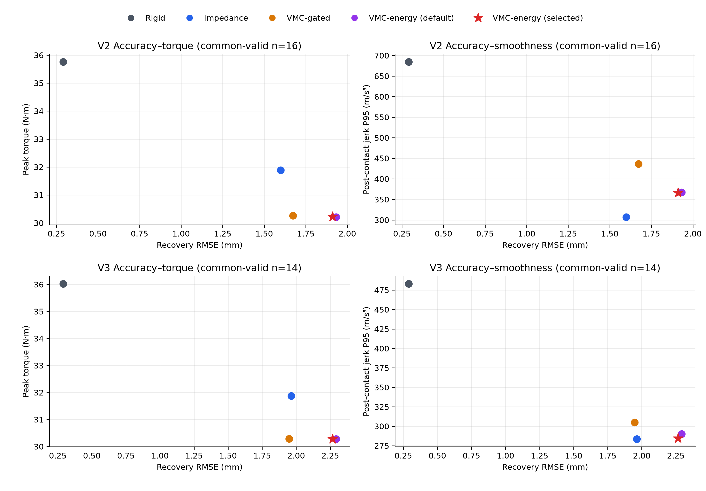

# 冻结参数的 V2/V3 最终 Holdout 评估

## 结论

独立 validation scan 选出的 `slow_smoothing` safety configuration 已在**不再调参**的冻结 V2 与 V3 fixture 上完成复验。它在两个集合都保持完整任务与碰撞有效性：**V2 为 16/16，V3 为 14/14**。相对原始 default VMC-energy，它在 V2/V3 上都小幅改善 recovery RMSE、recovery IAE、rejoin latency 与 post-contact jerk P95；V2 的 peak torque 和 torque-rate 则出现约 0.04% / 1.10% 的极小回退。

这构成了一个可复现的阶段性结果：**独立验证选出的参数没有在两份冻结测试集上崩溃，并对默认 energy setting 有跨集的一致小幅改善。** 但它不是“全面超越”结果：impedance 在两套测试上均有更低 recovery RMSE，且 jerk 仍稍低；rigid 的回归精度最好。因此当前最准确的表述仍是 VMC-energy 提供了低峰值力矩、显著低 torque-rate 的顺从恢复路径，以一部分回归精度为代价。

## 1. 冻结与数据隔离

参数不是在 V2/V3 上选择的。`slow_smoothing` 来自独立的 16-fixture validation scan，选择规则、参数空间和 budget-activation 诊断见 [validation scan report](../energy_safety_scan_expanded/energy_safety_scan_report.md)。选择完成后，配置 JSON 被冻结为：

```json
{
  "label": "slow_smoothing",
  "initial_energy_j": 0.80,
  "minimum_energy_j": 0.08,
  "maximum_energy_j": 1.20,
  "damping_recharge_efficiency": 0.60,
  "minimum_direction_scale": 0.30,
  "direction_transition_speed_mps": 0.08,
  "smoothing_time_constant_s": 0.08
}
```

每一次 V2/V3 episode 都由 runner 从 [冻结 JSON](../energy_safety_scan_expanded/selected_energy_safety_config.json) 读取该七参数配置；runner 输出还记录了实际注入的字段。评估前比较了服务器 manifest 与仓库冻结 manifest 的 SHA-256：

| 集合 | SHA-256 |
|---|---|
| V2 | `5e912479265a49ed1e2ada75689949d48c0c9d43468d75d3c4bd0697f1188cfa` |
| V3 | `ef5c2ee34bc728ac87345f4237a4bdef38a60e4282a3d69bac0d2dd638ecdc4e` |

二者在服务器与仓库中完全一致。V2 是已冻结的 16 个有效横向碰撞 fixture，V3 是独立、较困难的 14 个镜像横向 fixture；V3 仍仅覆盖 `±y` 横向扰动，**并非任意三维来向**。

## 2. 有效性与比较规则

每个 fixture 均以 rod/no-rod 配对方式运行。有效 episode 同时要求：有限仿真、实体 rod–hand 接触、接触力至少 15 N、冲量至少 0.45 N·s、稳定 rejoin、物块抬起且终点保持、无硬 torque limit，以及匹配 no-rod episode 成功。

| 集合 | Frozen fixture 数 | Selected VMC-energy valid | Common-valid 比较样本 |
|---|---:|---:|---:|
| V2 | 16 | 16 / 16 | 16 |
| V3 | 14 | 14 / 14 | 14 |

以下横向数值只使用每个 frozen suite 的 common-valid fixture set。历史 baseline JSON 也与服务器保存副本逐字节校验一致；本次没有重跑、修改或削弱 rigid / impedance baseline。

## 3. V2 结果（common-valid n=16）

| 方法 | Recovery RMSE (mm) | Recovery IAE (mm·s) | Rejoin latency (s) | Jerk P95 (m/s³) | Peak torque (N·m) | Torque-rate peak (N·m/s) |
|---|---:|---:|---:|---:|---:|---:|
| rigid | 0.290 | 0.198 | 0.000 | 684.686 | 35.762 | 669.656 |
| impedance | 1.599 | 1.054 | 0.262 | **307.155** | 31.884 | 370.209 |
| VMC-gated | 1.674 | 1.118 | **0.260** | 436.444 | 30.260 | 96.774 |
| VMC-energy default | 1.933 | 1.267 | 0.288 | 367.512 | **30.211** | **91.126** |
| **VMC-energy selected** | **1.911** | **1.257** | 0.282 | 365.968 | 30.224 | 92.128 |

相对 default VMC-energy，selected 在 V2 的 RMSE 降 **1.13%**、IAE 降 **0.82%**、rejoin latency 降 **1.83%**、jerk P95 降 **0.42%**；但 peak torque 增 **0.04%**，torque-rate peak 增 **1.10%**。因此 V2 支持“温和且可复现的默认设置改良”，不支持宣称大幅安全突破。

selected 相对 VMC-gated 的 jerk P95 低 **16.15%**、torque-rate peak 低 **4.80%**，但 RMSE 高 **14.21%**。相对 impedance，selected 的 peak torque 与 torque-rate peak 分别低 **5.21%**、**75.11%**，但 RMSE 高 **19.53%**，jerk 反而高 **19.15%**。

## 4. V3 结果（common-valid n=14）

| 方法 | Recovery RMSE (mm) | Recovery IAE (mm·s) | Rejoin latency (s) | Jerk P95 (m/s³) | Peak torque (N·m) | Torque-rate peak (N·m/s) |
|---|---:|---:|---:|---:|---:|---:|
| rigid | 0.289 | 0.202 | **0.013** | 483.089 | 36.023 | 672.630 |
| impedance | 1.964 | **1.264** | 0.327 | **283.495** | 31.872 | 366.138 |
| VMC-gated | **1.947** | 1.293 | 0.309 | 304.955 | 30.288 | 122.672 |
| VMC-energy default | 2.294 | 1.487 | 0.349 | 289.941 | 30.278 | 122.030 |
| **VMC-energy selected** | 2.266 | 1.474 | 0.344 | 284.344 | **30.274** | **121.982** |

selected 相对 default VMC-energy 在 V3 的 RMSE 降 **1.19%**、IAE 降 **0.86%**、rejoin latency 降 **1.47%**、jerk P95 降 **1.93%**；peak torque 与 torque-rate peak 也分别再低 **0.01%**、**0.04%**。与 V2 相同，改进幅度不大，但方向一致，且没有降低有效性。

相对 VMC-gated，selected 的 jerk P95 低 **6.76%**、torque-rate peak 低 **0.56%**，代价是 RMSE 高 **16.40%**。相对 impedance，selected 的 peak torque 与 torque-rate peak 分别低 **5.01%**、**66.68%**，而 RMSE 高 **15.38%**，jerk 也仅高 **0.30%**；因此不能说它在 V3 的 jerk 上超过 impedance。

## 5. 可视化



图中的红色星形是 selected VMC-energy；紫色圆点是 default VMC-energy。两个点在四张图中位置接近，直观地印证了参数扫描带来的提升是小幅而稳定的，而不是视觉上夸大的大迁移。Rigid 处于低 RMSE、但高 jerk / 高 torque-rate 的一端；VMC 系列则形成低 torque / 低 torque-rate 的另一支。

## 6. 科研上可以和不可以说什么

可以说：

- 独立 validation 选出的 80 ms direction smoothing 在两个冻结的 MuJoCo 横向撞击集上都保持 `100%` task/collision validity；
- 相比 default VMC-energy，它在 V2/V3 的恢复误差与 jerk 上均有小幅一致改善；
- selected VMC-energy 在两个集合都显著降低相对 impedance / rigid 的 torque-rate peak，并维持约 30.2 N·m 的峰值力矩；
- 低能量、零 recharge 压力测试已验证 energy budget 会在需要时实际缩放 return-drive，但当前选中配置的主要工作机制仍是 direction smoothing，而不是 tank 耗尽。

不可以说：

- 不能说 VMC-energy 在精度、平滑性和安全性每一项都胜过 rigid 或 impedance；
- 不能把 `energy-budget / passivity-inspired` filter 描述为整个 moving-reference robot system 的严格全局 passivity proof；
- 不能把 V2/V3 的 `±y` 结果泛化为任意来向 3D 撞击或真实机器人部署结论；
- 当前为确定性 MuJoCo fixture benchmark，尚不是跨随机 seed 的统计显著性分析。

## 7. 可复现材料与下一步

- [V2 selected holdout JSON](v2/benchmark_v2_ladder.json) 与 [CSV](v2/benchmark_v2_ladder.csv)
- [V3 selected holdout JSON](v3/benchmark_v2_ladder.json) 与 [CSV](v3/benchmark_v2_ladder.csv)
- [统一对比 JSON](energy_safety_final_holdout_comparison.json) 与 [CSV](energy_safety_final_holdout_comparison.csv)
- [统一 Pareto 图](energy_safety_final_holdout_pareto.png)
- Runner 的冻结 JSON 注入接口：`scripts/run_benchmark_v2_ladder.py --energy-safety-config-json ...`
- 对比与绘图脚本：`scripts/compare_energy_safety_holdout.py`

下一项合理工作是将 frozen `slow_smoothing` safety shield 固定为 RL / future ESN policy 的部署层，而不是重新用 V2/V3 改参数；同时另起 V4 多来向 fixture（明确实现并验证 x/z 方向 rod geometry）与多 seed 随机化评估。这样能把“固定横向 benchmark 的稳定结果”推进到更接近论文主张所需的泛化证据。
