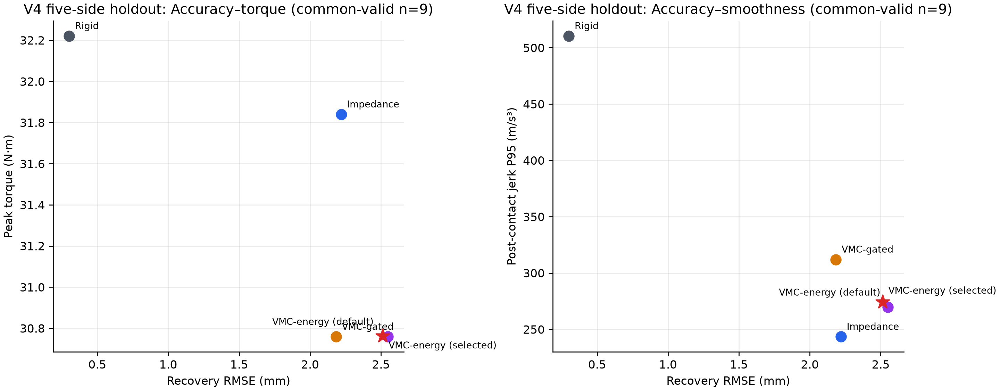

# V4 五侧向物理碰撞 Holdout Benchmark：冻结评估报告

## 一句话结论

V4 已完成一个**独立于 V4 geometry-development pilot 的、五侧向 axis-aligned physical collision holdout**：10 个由新撞击时机产生的候选全部通过固定的实体碰撞与抓取有效性门槛。冻结 controller 后，`impedance`、`VMC-gated`、默认 `VMC-energy` 和 selected `VMC-energy` 都是 10/10 有效，`rigid` 是 9/10 有效。五种方法共同有效的公平比较样本为 9 个 fixture。

在该 9-fixture common-valid 集上，rigid 的回归误差最低（0.301 mm），但 jerk（510.324 m/s³）和 torque-rate peak（618.750 N·m/s）最高；VMC 的明确收益仍是大幅减小 torque-rate，而不是全方位击败 rigid。冻结的 `slow_smoothing` selected VMC-energy 相对默认 VMC-energy 的恢复 RMSE 从 2.549 降至 2.513 mm（−1.43%），但 jerk 从 269.691 升至 274.445 m/s³（+1.76%），故不能声称它在 V4 上全面改善默认项。

## 1. 这个 benchmark 测什么

机器人在执行抓取轨迹时，有限质量的 MuJoCo cylinder rod 经 position-actuated slide 从指定世界坐标侧面与末端发生**实体接触**；系统随后要重新进入相对于 matched no-rod reference 的 5 mm / 80 ms trajectory tube，并完成物块抬起和终点保持。

这里的 no-rod trajectory 是配对无扰动参考，**不是**在线 WBC，也不代表数学意义的极限环。VMC 采用移动参考 / trajectory tube，因此“偏离—回归”是有限抓取任务中对移动吸引子回归的现象。

### V4 scope 与边界

| 维度 | V4 的实际覆盖 | 不可声称的内容 |
|---|---|---|
| 方向 | `−x`、`+x`、`−y`、`+y`、`−z` 五个物理构造侧面 | `+z`、六方向 sign-complete、任意连续 3-D 方向 |
| 物理性 | finite-mass rod、MuJoCo slide、真实 rod–hand contact | 仅后处理添加的虚拟外力、真实硬件验证 |
| 独立性 | 新撞击时机的 held-out realization | 新几何泛化；几何 / 行程来自 development pilot 后冻结 |
| 安全层 | energy-budget / passivity-inspired recovery filter | 整个 moving-reference robot system 的全局严格 passivity proof |

`positive_z` 未通过 stable rejoin，因此被诚实排除，没有放宽门槛来凑齐六方向。

## 2. 冻结 protocol

### Fixture 构造

五个已通过 development 的物理几何保持冻结，新的起撞时机为 **0.995 s** 与 **1.100 s**；二者均不同于 V4 pilot 的 1.060 / 1.140 s。也就是说，这是一项 held-out **impact-timing** 测试，而不是重新找几何或用 test 结果调 controller。

| 侧面 | stroke | interaction height | rod center (x, y) | holdout fixture 数 |
|---|---:|---:|---|---:|
| `negative_x` | 0.080 m | 0.540 m | (0.55, 0.00) m | 2 |
| `positive_x` | 0.130 m | 0.540 m | (0.55, 0.00) m | 2 |
| `negative_y` | 0.170 m | 0.540 m | (0.55, 0.00) m | 2 |
| `positive_y` | 0.170 m | 0.540 m | (0.55, 0.00) m | 2 |
| `negative_z` | 0.050 m | 0.540 m | (0.60, 0.00) m | 2 |

筛选 selector 固定为 six-dimensional tapered VMC（仅负责筛 fixture，绝不参与 ranking）。每个 fixture 都运行 rod / no-rod 成对 episode；`remove_rod_when_disabled=true`，保证 V4 的竖直 / 前后 support 不会静止占据无扰动参考的工作空间。

### 固定有效性门槛

- peak rod–hand contact force ≥ 15 N；
- contact impulse ≥ 0.45 N·s；
- finite simulation、实际 rod–hand contact、稳定 rejoin、物块抬起、终点保持、无 hard torque limit；
- matched no-rod task 同样成功。

所有 10 个候选均通过：接触峰力为 16.96–68.71 N，冲量为 1.135–5.064 N·s。完整候选与几何记录见 [holdout manifest](../holdout_screen/benchmark_v4_holdout_manifest.json)。

### 固定 controller ladder

| 方法 | 作用 |
|---|---|
| Rigid | 高刚度回归基线 |
| Impedance | 常规阻抗基线 |
| VMC-gated | 六维虚拟弹簧的接触后 gated 回归 |
| VMC-energy (default) | 默认 energy-budget / smoothing 配置 |
| VMC-energy (selected) | validation 中预先冻结的 `slow_smoothing` 配置 |

selected 配置在 V2/V3 独立 validation 后冻结：`E0=0.80 J`、`Emin=0.08 J`、`Emax=1.20 J`、damping recharge efficiency=0.60、minimum direction scale=0.30、direction transition speed=0.08 m/s、smoothing time constant=0.08 s。它不会写入 rigid、impedance 或 VMC-gated。

## 3. 有效性与公平样本

| 方法 | 有效 / 尝试 | 说明 |
|---|---:|---|
| Rigid | 9 / 10 | `v4holdout_positive_x_c1_t1` 未通过完整有效性门槛 |
| Impedance | 10 / 10 | 全有效 |
| VMC-gated | 10 / 10 | 全有效 |
| VMC-energy (default) | 10 / 10 | 全有效 |
| VMC-energy (selected) | 10 / 10 | 全有效 |

数值 controller 比较严格使用上述五方法都有效的 9 个 fixture。rigid 的 1 次失效没有被隐藏；它不在 common-valid 均值中，同时保留在 validity rate 中。

## 4. 主结果：9-fixture common-valid comparison

| 方法 | Recovery RMSE ↓ | Rejoin latency ↓ | Jerk P95 ↓ | Peak torque ↓ | Torque-rate peak ↓ |
|---|---:|---:|---:|---:|---:|
| Rigid | **0.301 mm** | **0.003 s** | 510.324 m/s³ | 32.220 N·m | 618.750 N·m/s |
| Impedance | 2.219 mm | 0.265 s | **243.473 m/s³** | 31.839 N·m | 253.197 N·m/s |
| VMC-gated | 2.184 mm | **0.260 s** | 311.944 m/s³ | **30.759 N·m** | **100.681 N·m/s** |
| VMC-energy (default) | 2.549 mm | 0.302 s | 269.691 m/s³ | 30.760 N·m | 100.678 N·m/s |
| VMC-energy (selected) | 2.513 mm | 0.295 s | 274.445 m/s³ | 30.763 N·m | 100.699 N·m/s |

### 可以支持的结论

1. **Rigid 精度最高，但动作最硬。** 它的 RMSE 仅 0.301 mm，却有最高 jerk 和最高 torque-rate；后者是 selected VMC-energy 的约 6.15 倍。
2. **VMC 的优势是驱动变化率。** selected VMC-energy 比 impedance 的 torque-rate peak 低 60.23%，同时峰力矩也低 3.38%；相比 rigid，torque-rate peak 低 83.73%、jerk 低 46.22%、峰力矩低 4.52%。代价是 recovery RMSE 增大。
3. **VMC-gated 是本套 VMC 中更好的 accuracy–smoothness 折中。** 它相较 impedance 略低 RMSE（2.184 vs 2.219 mm）但 jerk 更高（311.944 vs 243.473 m/s³）；相较 VMC-energy，RMSE 更低，且仍保留约 100.7 N·m/s 的低 torque-rate。
4. **selected safety config 不是 V4 上的全面胜者。** 相比 default VMC-energy，selected 的 RMSE 改善 1.43%、rejoin latency 缩短 2.32%，但 jerk 恶化 1.76%、peak torque / torque-rate 均约增加 0.02%。这说明 V2/V3 上选择出的 smoothing 参数在五侧向 V4 上保持可行且精度小幅改善，但没有稳定地支配 default。

## 5. 分方向读法与 phase 分析

五个侧面都进入 common-valid 比较（但 `+x` 只剩 1 个 common fixture，原因是 rigid 的较晚时机失效）。结果显示 VMC 的低 torque-rate 并非只来自某一侧面：`−x / −y / −z / +x / +y` 的 selected torque-rate 分别为 71.689 / 104.624 / 91.654 / 144.085 / 113.137 N·m/s，均显著低于对应 rigid 值。

从 phase 角度，所有有效 episode 依次包含：nominal reach → rod contact / yield → rod release → trajectory-tube rejoin → lift → hold。rigid 的 rejoin latency 接近零，是因为它强力压制偏移；VMC/impedance 则允许更大的 yield（selected VMC-energy 平均 16.268 mm），所以有 0.260–0.302 s 的可见偏离—回归过程。这正是本 benchmark 所展示的柔顺性—恢复精度折中。

## 6. 可复现材料

- fixture screening：[`scripts/screen_benchmark_v4_holdout.py`](../../../scripts/screen_benchmark_v4_holdout.py)
- frozen ladder runner（支持 V4 clean no-rod reference）：[`scripts/run_benchmark_v2_ladder.py`](../../../scripts/run_benchmark_v2_ladder.py)
- comparison builder：[`scripts/compare_v4_final_holdout.py`](../../../scripts/compare_v4_final_holdout.py)
- selector screen manifest：[benchmark_v4_holdout_manifest.json](../holdout_screen/benchmark_v4_holdout_manifest.json)
- default ladder raw rows：[benchmark_v2_ladder.csv](default/benchmark_v2_ladder.csv)
- selected ladder raw rows：[benchmark_v2_ladder.csv](selected/benchmark_v2_ladder.csv)
- auditable merged summary：[v4_final_holdout_comparison.json](v4_final_holdout_comparison.json)

## 7. 后续最有价值的改进

1. 单独解决 `positive_z` 的接触位置 / rod geometry，使其满足稳定 rejoin；在此之前不能把 V4 写成六方向。
2. 针对 V4 的多轴 fixture 另设 validation split，预注册多目标准则（RMSE、jerk、torque-rate），而不是复用 V2/V3 的 selected 参数声称全域最优。
3. 在 frozen benchmark 之上接入不读取 rod/contact/future-impact 信息的 ESN actor 或 RL stiffness policy，且必须和这里的 fixed ladder 共用 fixture 与 common-valid 规则。
