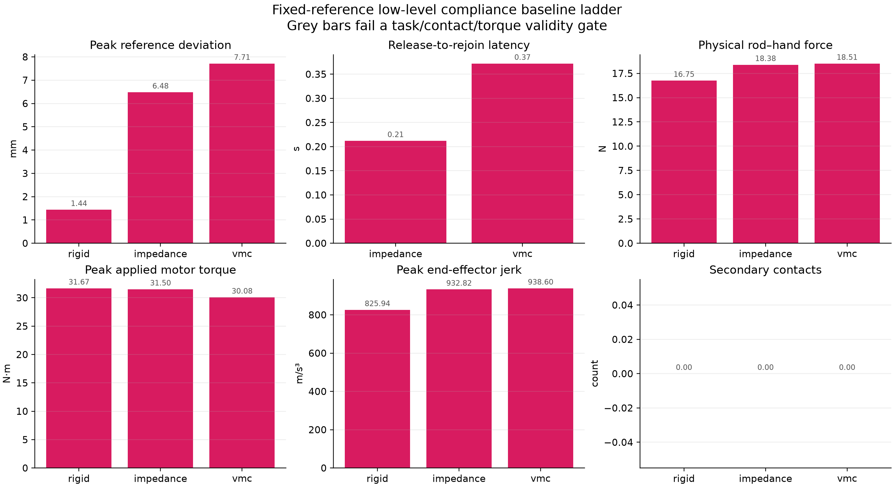
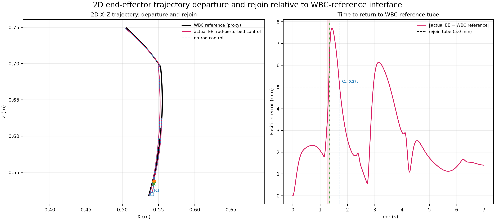
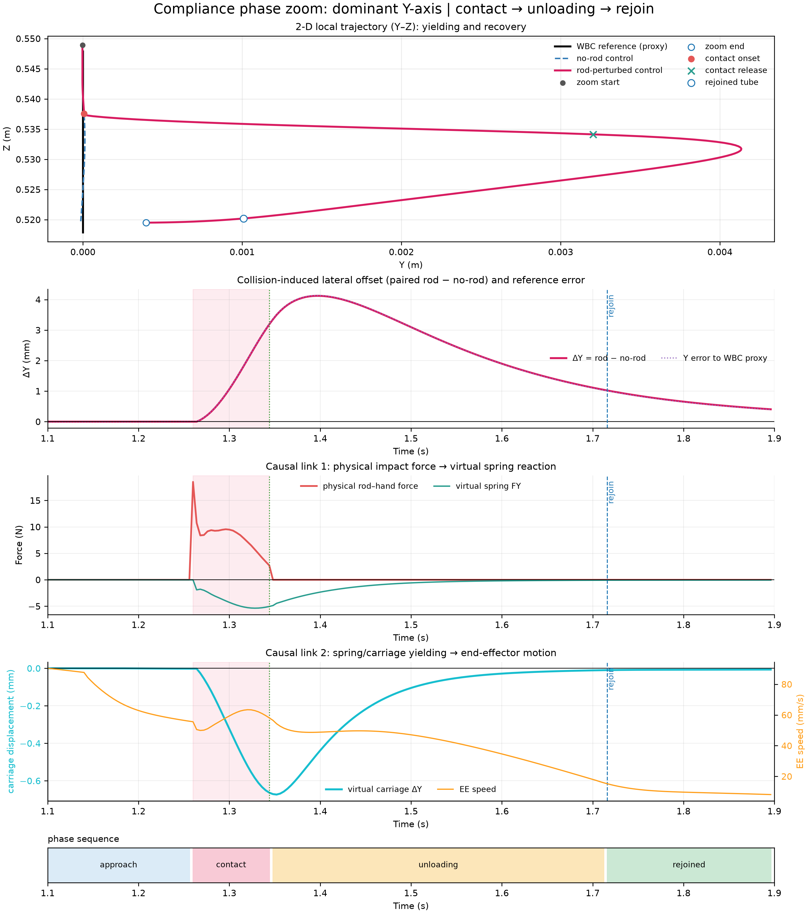
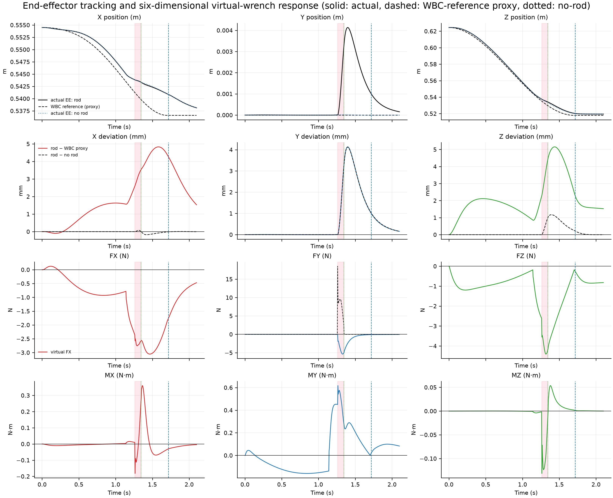
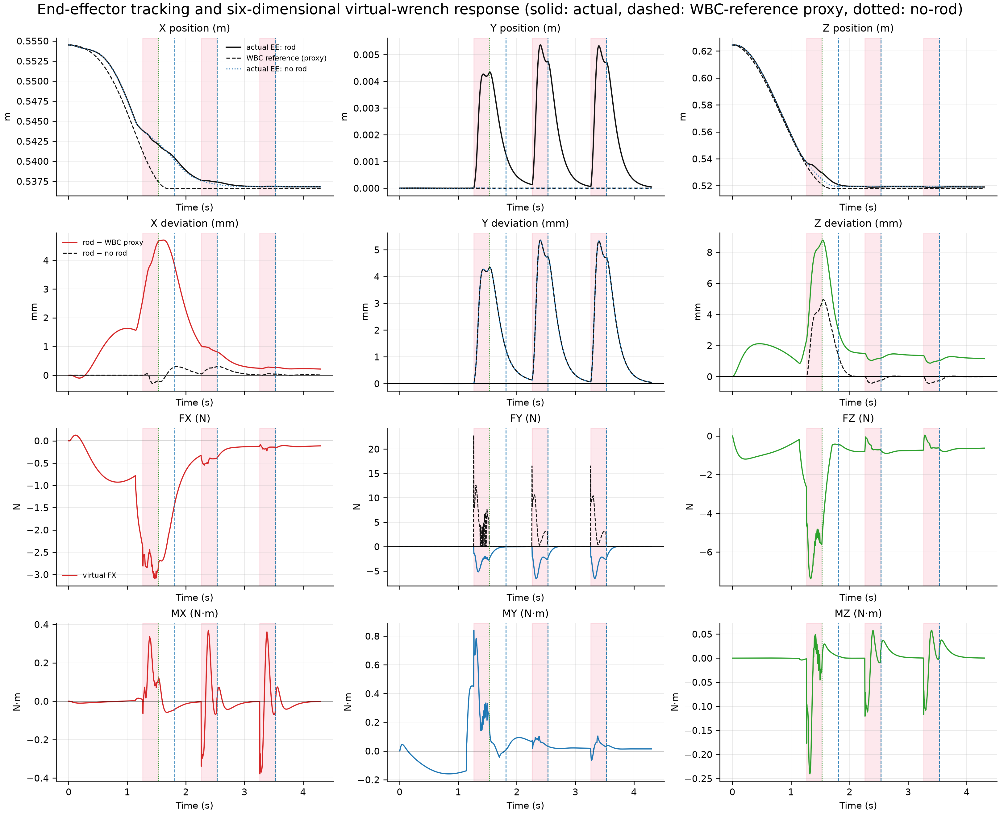
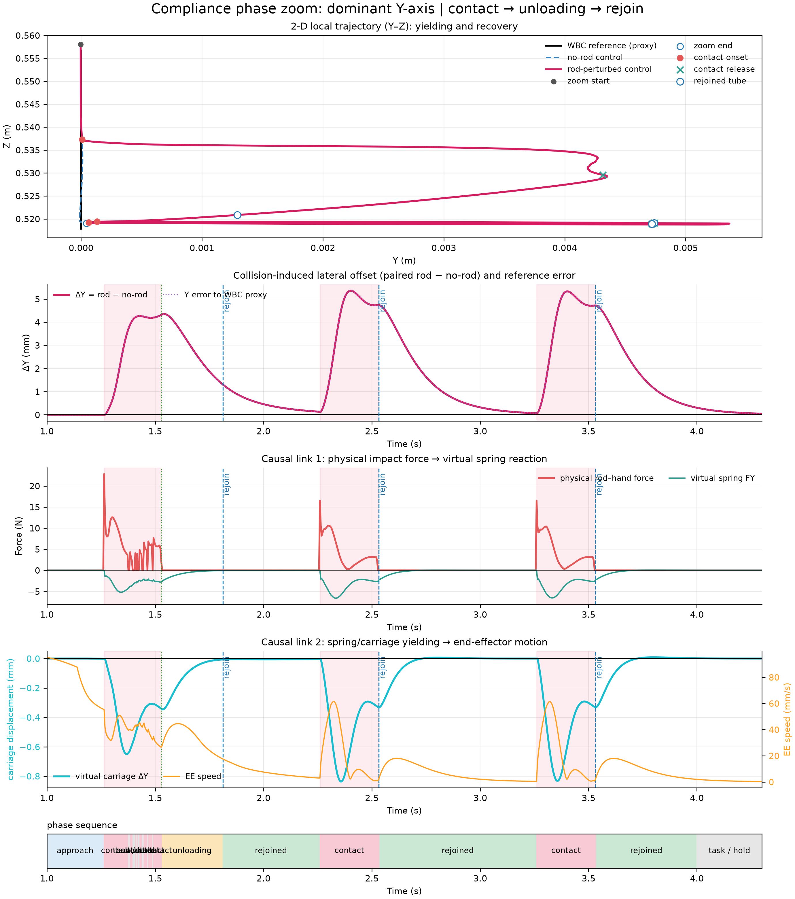
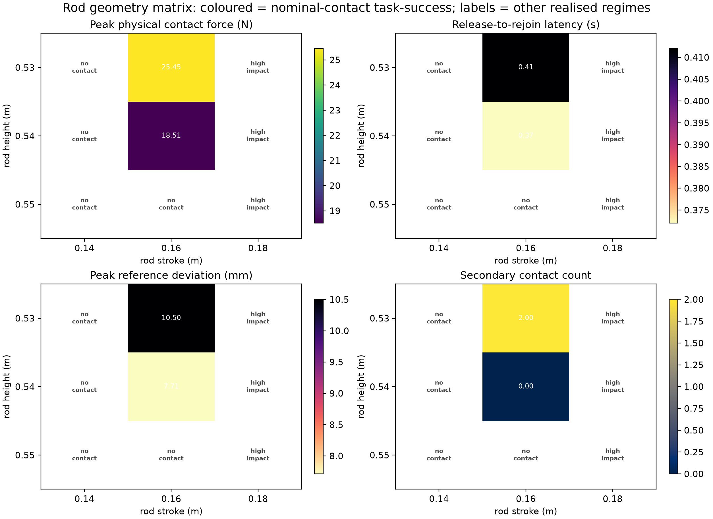

# V1 有效碰撞 Benchmark、Phase 分析与 Baseline Ladder

> 状态：已在服务器端 MuJoCo 完整运行并归档。代码版本在本报告提交的 Git commit 中固定。  
> 范围：这是 Franka Panda 的**仿真**、固定名义参考（fixed-reference proxy）实验；它不是实机结果，也不是完整 WBC 的替代或重新设计。

## 一句话结论

这套 V1 benchmark 已把“碰到了机械臂”“发生让位”“能在抓取前回到参考管内”“抓取任务仍完成”分开验证。它建立了可靠的比较地基，但没有提供“VMC 全面优于 rigid”的结论：rigid 高增益端点的轨迹误差最小；显式平移 VMC 在本固定碰撞下使用最低峰值关节力矩，却以更大的让位幅度和更长的回归时间为代价。这个如实暴露的权衡，正是后续 ESN 应在同一 benchmark 上改善的对象。

## 1. 问题、边界和公平性

Panda 在桌面上沿可达的名义末端轨迹下降、闭爪并抬起一个自由物块。闭爪前，一根有限质量的圆柱杆经一个物理 slide joint 从侧面推向 `hand_collision`；杆不是 mocap teleport，碰撞由 MuJoCo 接触求解器计算。每个带杆实验均配一个完全一致的 `--disable-rod` 配对对照，以分离名义跟踪误差与碰撞导致的额外偏移。

名义轨迹仅代表未来真实系统中的 `WBC → (pose, twist)` 接口；本 V1 中它是可重复的 moving-trajectory proxy。故所有图中 “WBC reference” 均应理解为该接口代理，不能表述为在线 WBC 或实机安全结论。

所有 ladder 行共享：

- 同一 Franka Panda 模型、物块、桌面、杆、杆轨迹、名义参考、抓取时间和关节力矩限制/斜率限制；
- 杆高度 `0.54 m`、行程 `0.16 m`、接触时间常数 `0.015 s`；
- 抓取开始 `2.10 s`；VMC 使用 `kappa=35`、阻尼比 `0.8`、drive scale `8.0`、显式平移虚拟小车质量 `1.0 kg`；
- 轨迹误差为实际 EE 相对 nominal reference；paired offset 为带杆 EE 相对 matched no-rod EE；
- 只有固定的低层顺应模块改变，名义参考不随控制器改变。

三个控制器的定义也刻意不混淆：

| 行 | 控制器含义 | 主要参数 |
|---|---|---|
| `rigid` | 高刚度、受限的直接 Cartesian tracking 端点 | 平移/转动刚度 `8000 N/m` / `360 Nm/rad`，阻尼比 `1.5`，力/力矩界 `90 N` / `12 Nm` |
| `impedance` | 固定受限 Cartesian spring–damper | `900 N/m` / `45 Nm/rad`，阻尼比 `1.2`，界 `24 N` / `3 Nm` |
| `vmc` | 六通道虚拟机构：虚拟小车与 EE 之间的受限 spring–damper | 公共 `kappa=35`，显式三平移小车；旋转通道仍是 VMC 内部状态 |

`rigid` 是低层高增益端点，不是 WBC 本身；`impedance` 也不是本文要做的 ESN 方法。它们的作用是形成从刚性执行到固定阻抗再到虚拟机构的可复现 baseline ladder。

## 2. 有效性门控：不把“假碰撞”当作成功

一条带杆结果首先必须同时满足：有限数值、杆–手真实接触、峰值物理接触力至少 `1 N`、释放后稳定回归、物块抬起、结束时仍被持有、没有 hard torque-limit 帧，以及 matched no-rod 任务也通过。仅由 MuJoCo 接触对产生的布尔值不足以证明碰撞有效，因此还将实际碰撞分为下列**实验操作分级**（不是人体安全阈值）：

| 类别 | 规则 | 用途 |
|---|---|---|
| `no_contact` | 峰值力 `< 1 N` 或 impulse 为 0 | 无效，禁止用于性能比较 |
| `grazing_contact` | `1–9 N` | 记录为浅擦碰，禁止用于主排名 |
| `nominal_contact` | `9–30 N` | 唯一用于横向 controller ranking 的名义碰撞集合 |
| `high_impact` | `> 30 N` | 压力测试；保留、报告，但不和名义碰撞混合排名 |

这条规则排除了 `h=0.55 m, stroke=0.16 m` 的表面“接触”：虽然接触对曾短暂报告为真，峰值只有 `0.434 N`，与 no-rod 的 paired offset 只有 `0.010 mm`，故明确记为 `no_contact`，不能被写成顺应性能。

## 3. Phase 分析定义

每条 trace 保存一个整数 `phase` 和对应 JSON。连续接触之间不超过 `20 ms` 的 solver-scale 空隙会合并成一个物理接触窗口，防止把一次碰撞抖动误数为多次碰撞。主接触后，EE 位置误差须小于 `5 mm` 并持续至少 `80 ms`，才宣布 rejoin。

| Phase | 定义 |
|---|---|
| `approach` | 第一次有效 rod–hand contact 之前，且 gripper 尚未闭合 |
| `contact` | 主 rod–hand 接触窗口 |
| `unloading` | 主接触释放后，到连续满足 `5 mm / 80 ms` rejoin 判据前 |
| `rejoined` | 已稳定进入 nominal reference tube、但尚未开始抓取 |
| `task` | gripper closure 及随后的物理抓取/抬升阶段 |

在名义 fixture 中，三个 baseline 都只有一次主接触、没有 secondary contact：

| 控制器 | 接触窗口 (s) | 释放→回归 (s) | `contact / unloading / rejoined` 时长 (s) |
|---|---:|---:|---:|
| rigid | 1.260–1.364 | 0.000 | 0.092 / 0.000 / 0.732 |
| impedance | 1.260–1.348 | 0.212 | 0.088 / 0.208 / 0.540 |
| VMC | 1.260–1.344 | 0.372 | 0.088 / 0.368 / 0.384 |

rigid 在杆释放时已经位于 `5 mm` tube 内，所以其 latency 是 `0 s`；这是高刚度端点的预期结果，并不意味着它在力矩或真实硬件接触安全方面自动更优。

## 4. Rigid / impedance / VMC ladder 结果

三个行都通过上述完整任务门控（真实有效接触、后续 lift/hold、零 hard-limit 帧）。数值保留两位小数用于表格可读性；完整精度在 [baseline_ladder_summary.json](benchmark_artifacts_v1/baseline_ladder_summary.json) 和 CSV 中。

| 控制器 | 峰值参考偏差 (mm) | paired offset (mm) | RMSE (mm) | 回归 (s) | 接触力 / impulse | 峰值电机力矩 (Nm) | jerk (m/s³) |
|---|---:|---:|---:|---:|---:|---:|---:|
| rigid | 1.44 | 0.92 | 0.30 | 0.000 | 16.75 / 0.695 | 31.67 | 825.94 |
| impedance | 6.48 | 3.82 | 2.10 | 0.212 | 18.38 / 0.710 | 31.50 | 932.82 |
| explicit VMC | 7.71 | 4.29 | 3.13 | 0.372 | 18.51 / 0.723 | **30.08** | 938.60 |



应作如下解释：

1. rigid 以最高峰值力矩获得最小误差，符合高刚度跟踪端点的预期；它不是一个应被 VMC 以单一误差指标“击败”的 strawman。
2. impedance 和 VMC 的实际接触力/冲量相近（18.38/0.710 对 18.51/0.723），VMC 的峰值关节力矩最低；相对 rigid 低 `1.59 Nm`（约 5.0%）。
3. VMC 的让位和回归时间更大，且 jerk 没有低于 impedance。因此本轮结果支持“存在可测 trade-off”，不支持“VMC 已全面更平顺/更精确”。
4. 在固定名义碰撞下三者都没有 secondary contact；多次碰撞是更强几何扰动中的压力测试现象，不能通过单一 fixture 推断。

下图显示 VMC 主候选的 2D 轨迹及误差时间线。黑线为名义接口、红线为真实 EE、蓝虚线为 no-rod 对照；绿色为实际接触释放、蓝色虚线为满足 rejoin tube 的时刻。图中的实际峰值偏差约 `7.71 mm`，在释放后 `0.372 s` 稳定回到 reference tube。



完整的速度、物理接触力、六通道虚拟力/力矩和关节电机力矩图见：[VMC dynamics](benchmark_artifacts_v1/vmc_wbc_rejoin_dynamics_results.png)。

### 4.1 汇报用的柔顺相位放大图

上一张全周期图适合审计完整日志，但不适合直观看“让位—卸载—回归”：本 fixture 的杆沿世界 `y` 方向推手，而早期的 `X–Z` 投影会把主要偏移隐藏；同时实际接触窗口只有约 `84 ms`，放在完整抓取周期中会被压缩。因此汇报主图使用局部 `1.10–1.90 s` 窗口，并自动选择 paired rod/no-rod 偏移最大的 Cartesian 轴。当前 VMC 行自动识别为 `Y`，所以轨迹面为 `Y–Z`。



读图顺序如下：

1. 上图的红线是带杆的实际末端轨迹，蓝虚线是完全匹配的 no-rod 实际轨迹，黑线是名义 `WBC reference` 接口代理；红线向 `+Y` 偏移后沿回归方向收拢。
2. 第二行的主指标是 `ΔY = rod − no-rod`，它剔除了 no-rod 本身的名义跟踪误差；本行峰值约 `4.12 mm`。紫色点线才是相对于 reference proxy 的总 Y 误差，不能把二者混为一谈。
3. 第三行把真实杆–手接触力和虚拟弹簧 `F_Y` 放在同一时间轴上，显示“物理撞击 → 虚拟反力”的因果顺序；红色阴影是合并后的物理接触窗口，绿色虚线是接触释放。
4. 第四行把虚拟小车位移和末端速度分成左右两个纵轴，避免毫米级弹簧让位被速度曲线压扁。当前小车 `Y` 向峰值位移约 `0.67 mm`；这解释了为什么主 ladder 是可量化的中等顺应，而不是夸张的演示工况。
5. 最底部 phase ribbon 明确标出 `approach → contact → unloading → rejoined`。蓝色虚线 `rejoin` 仍使用全三维位置误差小于 `5 mm` 且持续 `80 ms` 的严格门控；当前释放到回归为 `0.372 s`。

这张图是对主 benchmark 的更合适的可视化，不改变任何物理数据、接触门控或 controller ranking；它也不把 fixed-reference proxy 写成真实在线 WBC。

### 4.2 论文式六维时域结果图

为便于和虚拟机构论文中常用的时域结果图直接对照，另归档一张统一时间轴的 `4 × 3` 面板图：



- 第一行：`X/Y/Z` 位置。实线为真实带杆 EE，虚线为 fixed `WBC reference` 接口代理，点线为 matched no-rod EE；因此轨迹拟合、碰撞偏离和回归均可直接读出。
- 第二行：`rod − reference`（彩色实线）与 `rod − no-rod`（黑色虚线）三轴偏差。后者是应优先报告的碰撞诱发偏移，而不是把固定名义跟踪误差误当作碰撞效果。
- 第三行：虚拟机构的 `F_X/F_Y/F_Z`。`F_Y` 面板额外叠加 MuJoCo 实测的无符号物理 rod–hand force（黑色虚线）；这个标量力不能伪装成带方向的三维外力，因此只作为碰撞时序和强度的证据。
- 第四行：虚拟机构的 `M_X/M_Y/M_Z`。当前主 fixture 没有显式的旋转小车，故这是 VMC 内部旋转通道的虚拟力矩响应，而不是六轴腕力传感器读数。

粉色阴影、绿色点线和蓝色虚线在所有面板中共享，分别表示真实接触、接触释放和通过三维 `5 mm / 80 ms` rejoin 门控。该图使用 `0.0–2.1 s` 的 pre-grasp 时间段，避免抓取/抬升阶段稀释碰撞响应。

### 4.3 多周期真实碰撞可视化演示（不进入主排名）

为展示多个“撞击 → 让位 → 回归”过程，另外运行了一组专门的视觉演示。该演示仍使用 MuJoCo 的有限质量物理杆和完全匹配的 `--disable-rod` 对照；它不是把单个周期复制三遍，也不把任务成功或控制器排名结论扩展到多周期场景。为了让重复扰动发生在同一个末端位置，演示在 `1.70 s` 到达 pre-grasp pose 后保持名义参考，并把抓取时间延后到 `4.0 s`，因此该组实验的 `target_lifted_after_recovery=false` 是预期设置，不能当作抓取成功率结果。

演示参数为 `kappa=35`、阻尼比 `0.8`、显式平移小车质量 `1.0 kg`、杆高 `0.54 m`、杆行程 `0.16 m`、`3` 个周期、周期长度 `1.0 s`。由真实接触信号识别出三个独立接触窗口：

| 周期 | 接触窗口 (s) | 释放后状态 |
|---|---:|---|
| 1 | `1.264–1.528` | `1.812 s` 进入 `5 mm / 80 ms` reference tube |
| 2 | `2.260–2.532` | 释放时已在 tube 内，随后保持回归 |
| 3 | `3.260–3.532` | 释放时已在 tube 内，随后保持回归 |

三个窗口的峰值杆–手接触力约 `22.84 N`，不是无接触或重复绘图伪影；带杆相对 matched no-rod 的最大三维偏移约 `6.59 mm`。其中第 2、3 次释放时已经满足回归管判据，所以图中的回归虚线与释放时刻重合，这表示“没有重新离开 5 mm 管”，不是漏检。



这张 `4 × 3` 图沿用上一节的含义：第一行是 `X/Y/Z` 位置，第二行是相对 reference proxy 和 matched no-rod 的偏差，第三行是虚拟平移力并叠加无方向的杆–手标量接触力，第四行是 VMC 内部旋转通道虚拟力矩。粉色阴影对应三个真实接触窗口；绿色点线是接触释放；蓝色虚线是通过回归管判据的时刻。它适合作为汇报中的“多周期响应”主图，但不能替代主 benchmark 的单次有效碰撞 ranking。



## 5. 碰撞几何矩阵

在 VMC 主配置下扫描 `height ∈ {0.53, 0.54, 0.55} m`、`stroke ∈ {0.14, 0.16, 0.18} m`。这是一个 **height × disturbance-strength** 矩阵；杆的世界 `y` 方向保持固定，尚不是多方向鲁棒性声明。



| 几何 | 接触分级 | 峰值力 (N) | paired offset (mm) | 回归 (s) | secondary | 解释 |
|---|---|---:|---:|---:|---:|---|
| 0.53 / 0.14 | no_contact | 0.00 | 0.00 | — | 0 | 无效：没有真实碰撞 |
| 0.53 / 0.16 | nominal | 25.45 | 7.07 | 0.412 | 2 | 较强但可比较的名义接触 |
| 0.53 / 0.18 | high-impact | 77.99 | 34.25 | 0.504 | 1 | 压力测试，不可混入主表 |
| 0.54 / 0.14 | no_contact | 0.00 | 0.00 | — | 0 | 无效：没有真实碰撞 |
| 0.54 / 0.16 | nominal | 18.51 | 4.29 | 0.372 | 0 | 主 benchmark fixture |
| 0.54 / 0.18 | high-impact | 76.71 | 33.00 | 0.384 | 1 | 压力测试 |
| 0.55 / 0.14 | no_contact | 0.00 | 0.00 | — | 0 | 无效：没有真实碰撞 |
| 0.55 / 0.16 | no_contact | 0.43 | 0.01 | 0.420* | 0 | 近擦碰；`*` 不作为回归性能 |
| 0.55 / 0.18 | high-impact | 57.36 | 21.90 | 0.368 | 0 | 压力测试 |

所以 V1 的推荐正式 fixture 是 `h=0.54 m, stroke=0.16 m`。第二个 nominal fixture `0.53 / 0.16` 用来检验对更强但仍受控碰撞的稳健性；高冲击情况应该保留为 stress suite，而不是让训练/调参只在“容易低误差”的无接触工况上取得好看数据。

## 6. 可复现命令

服务器运行环境的路径由部署决定；以下以已使用的 menagerie 和 Python 环境为例：

```bash
cd /home/arm1/vmc_mujoco_runtime/mujoco_6d_vmc_benchmark
export MUJOCO_GL=egl MPLBACKEND=Agg

# 同一实体碰撞下的三层 baseline（每一行自动附带 no-rod 配对）
/home/arm1/vmc_mujoco_runtime/.venv/bin/python scripts/run_baseline_ladder.py \
  --menagerie /home/arm1/vmc_mujoco_runtime/mujoco_menagerie \
  --output-dir outputs/benchmark_ladder_v1 --explicit-vmc \
  --kappa 35 --damping-ratio 0.8 --carriage-drive-scale 8 \
  --rod-stroke 0.16 --rod-height 0.54 --grasp-time 2.1

# VMC 的有效碰撞几何矩阵（每格也自动附带 no-rod 配对）
/home/arm1/vmc_mujoco_runtime/.venv/bin/python scripts/run_geometry_matrix.py \
  --menagerie /home/arm1/vmc_mujoco_runtime/mujoco_menagerie \
  --output-dir outputs/geometry_matrix_v1 \
  --heights 0.53 0.54 0.55 --strokes 0.14 0.16 0.18

# 汇总图
/home/arm1/vmc_mujoco_runtime/.venv/bin/python scripts/plot_benchmark_summary.py \
  --ladder-json outputs/benchmark_ladder_v1/baseline_ladder_summary.json \
  --geometry-json outputs/geometry_matrix_v1/geometry_matrix_summary.json \
  --output-dir outputs/benchmark_summary_v1

# 多周期真实碰撞视觉演示（仅用于展示，不进入主排名）
/home/arm1/vmc_mujoco_runtime/.venv/bin/python scripts/run_rod_perturbation_benchmark.py \
  --menagerie /home/arm1/vmc_mujoco_runtime/mujoco_menagerie \
  --output-dir outputs/vmc_visual_multicycle_v4/rod --controller-mode vmc \
  --kappas 35 --damping-ratio 0.8 --carriage-drive-scale 8 \
  --explicit-translational-carriage --carriage-mass-kg 1.0 \
  --rod-height 0.54 --rod-stroke 0.16 --rod-cycles 3 \
  --rod-cycle-period 1.0 --response-only --grasp-time 4.0 \
  --recovery-kappa 35 --recovery-ramp 0.01 \
  --recovery-carriage-drive-scale 8

# 对同一参考和时间轴生成 matched no-rod 对照后，再调用：
/home/arm1/vmc_mujoco_runtime/.venv/bin/python scripts/plot_trajectory_results.py \
  --rod-trace outputs/vmc_visual_multicycle_v4/rod/rod_perturbation_kappa_35.00_trace.npz \
  --no-rod-trace outputs/vmc_visual_multicycle_v4/no_rod/rod_perturbation_kappa_35.00_trace.npz \
  --output-dir outputs/vmc_visual_multicycle_v4/figures \
  --grasp-time 4.0 --rod-cycles 3 --rod-cycle-period 1.0 \
  --paper-time-start 0.0 --paper-time-end 4.3 \
  --compliance-zoom-start 1.0 --compliance-zoom-end 4.3
```

脚本具有 resume 行为：已有 rod/no-rod summaries 时不会重新仿真；不过总会刷新当前图和汇总文件。因此重新画图或修改报告不会无意改变物理试验。

## 7. 后续 ESN 前必须保持的约束

1. ESN 输入只使用未来部署时存在的历史：`q, qdot, v_WBC`（以及可部署的状态）；contact geometry、力和 rollout 只可作为训练期 teacher 信息。
2. ESN 的输出应受限为速度尺度 `s_t` 与有界 Cartesian yielding residual `Δẋ_yield`，之后仍经过同一个 torque/safety filter；不能改变固定 WBC 的职责。
3. 比较 ESN 时必须复用本报告的 rod、reference、任务门控、paired no-rod 对照、contact regime 和 phase 定义；并纳入 rigid / impedance / VMC 以及合理的 history baselines（Window、GRU、TCN）。
4. 要证明 ESN 的价值，需要构造仅靠瞬时状态无法消歧的 history-dependent collision/obstacle 情形；不能只在此 deterministic 单杆工况上宣称 ESN 优于所有方法。

## 8. 归档

- 精确 ladder 数值：[JSON](benchmark_artifacts_v1/baseline_ladder_summary.json)、[CSV](benchmark_artifacts_v1/baseline_ladder_summary.csv)
- 精确 geometry 数值：[JSON](benchmark_artifacts_v1/geometry_matrix_summary.json)、[CSV](benchmark_artifacts_v1/geometry_matrix_summary.csv)
- 产生脚本：[run_baseline_ladder.py](../scripts/run_baseline_ladder.py)、[run_geometry_matrix.py](../scripts/run_geometry_matrix.py)、[plot_benchmark_summary.py](../scripts/plot_benchmark_summary.py)
- 原始 trace、每个 case 的详细图和 server execution logs 保存在服务器 `outputs/benchmark_ladder_v1/`、`outputs/geometry_matrix_v1/`；这里提交的是体积较小、可审阅的 summary artifacts。
