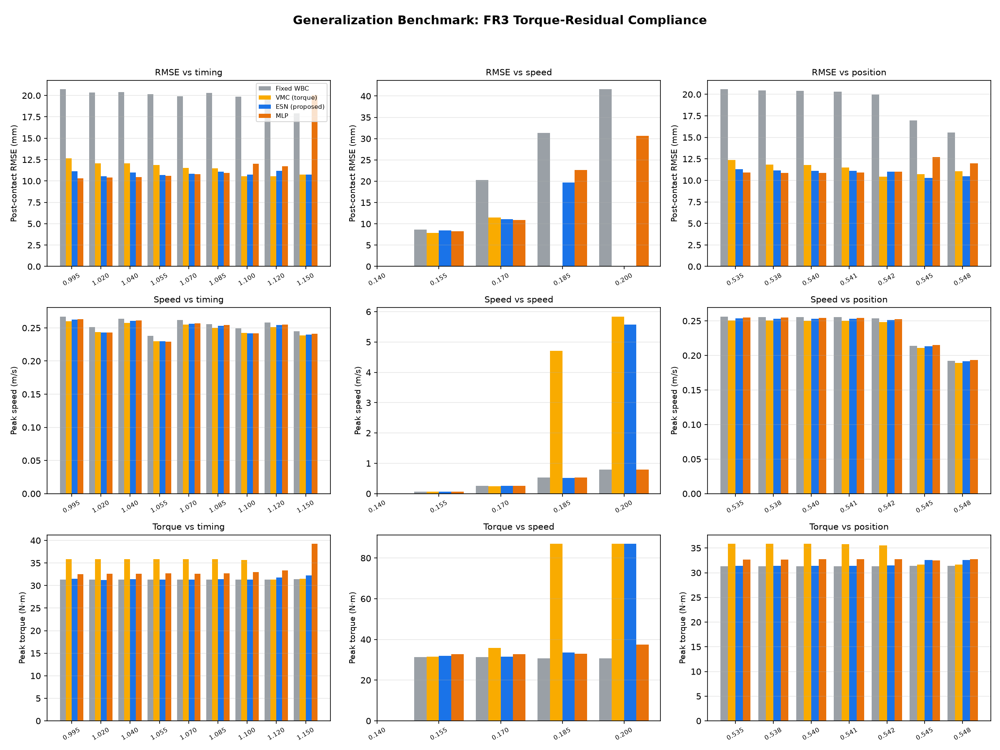
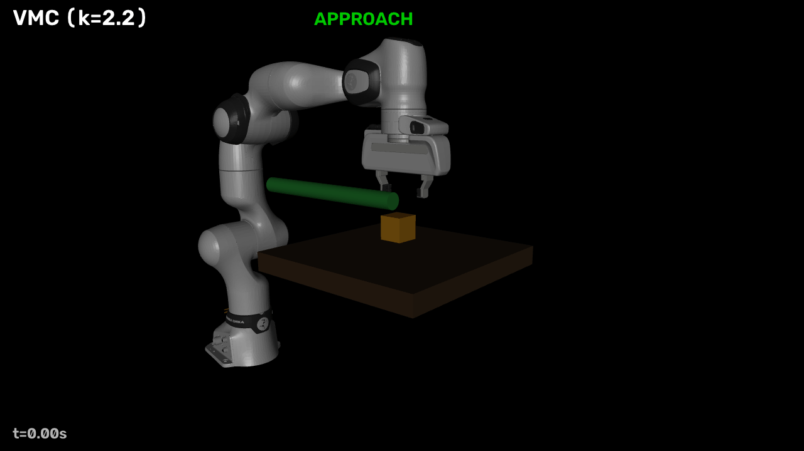
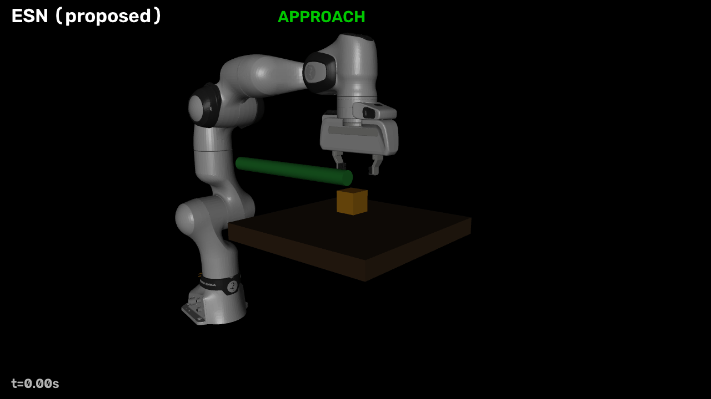

# Franka Research 3 Direct ESN Compliance Controller — 完整汇报

## 1. 系统架构

```text
┌─────────────────────────────────────────────────────────┐
│              Proposed Architecture (FR3)                 │
│                                                          │
│  WBC (Whole-Body Controller)                            │
│  │  Input: q(7), q̇(7)                                   │
│  │  Output: nominal twist ξ_nom(6) → q̇_cmd(7)            │
│  ▼                                                       │
│  Velocity Servo (shared, non-learned)                   │
│  │  τ_servo = K_v(q̇_cmd − q̇) + τ_gravity               │
│  ▼                                                       │
│  Compliance Policy (ESN / VMC / MLP)                    │
│  │  Input: 32-D [q, q̇, ξ_nom, e_pose, ė_twist]         │
│  │  Output: 7-D per-joint residual torque               │
│  │  τ_residual = π(x) · Δτ_budget                       │
│  ▼                                                       │
│  τ_total = clip(τ_servo + τ_residual, ±τ_max)          │
│  ▼                                                       │
│  Franka Research 3 + Panda Hand (MuJoCo)               │
└─────────────────────────────────────────────────────────┘
```

**核心设计选择**：控制策略输出**力矩残差**（阻抗式柔顺），而非修改速度参考（导纳式）。力矩残差直接改变碰撞瞬间的力平衡，降低接触力和末端偏移——这是 twist 层方法无法实现的力学通路。

---

## 2. 数学建模

### 2.1 WBC 速度伺服（执行层）

$$\tau_{\text{servo}} = K_v (\dot{q}_{\text{cmd}} - \dot{q}) + \tau_{\text{gravity}}(q)$$

Fixed WBC = 零残差力矩（$\tau_{\text{residual}} = 0$），机器人刚性跟踪名义轨迹。

### 2.2 Proposed: Direct ESN

**Reservoir 动力学**（固定随机循环网络）：
$$s_{t+1} = (1-\alpha)\,s_t + \alpha \tanh(W_{\text{in}} x_t + W_r s_t + b)$$

- $s_t \in \mathbb{R}^{160}$：reservoir 状态
- $W_r$：循环权重（随机固定，谱半径 $\rho < 1$ → echo state property）
- $\alpha = 0.04/0.12$：泄漏率

**线性读出**（唯一可训练参数）：
$$a_t = \tanh(W_{\text{out}} \cdot [1;\, x_t;\, s_t]) \in [-1,1]^7$$

**力矩解释**：$\tau_{\text{residual}} = a_t \odot \Delta\tau_{\text{budget}}$，其中 $\Delta\tau_{\text{budget}} = 5\% \times \tau_{\text{limits}}$

**激活门控**（基于位置误差，部署可用）：
$$\text{gate} = \text{smoothstep}\left(\frac{\|e_{\text{pos}}\| - 4\text{mm}}{8\text{mm}}\right)$$

**训练管线**（特权蒸馏）：
1. Counterfactual Teacher（特权：接触力、反事实推演）
2. Teacher DAgger → 确定性参考教师
3. Coverage Behavior Cloning：教师在参数化碰撞网格上 rollout，$(x_t, a_t)$ 对用于岭回归

### 2.3 Baseline 1: VMC-Torque（虚拟模型控制，阻抗式）

**弹簧-小车动力学**（忠实复刻 Zhang et al. IROS 2024）：
$$m\ddot{x}_c + d_c\dot{x}_c = f_{\text{drive}} + w(x_c, \dot{x}_c)$$

**饱和弹簧耦合**（Zhang et al. rock-chop Eq. 2）：
$$w = \sigma \tanh\big(K_e (x_{\text{ee}} - x_c) / \sigma\big) + D_e(\dot{x}_{\text{ee}} - \dot{x}_c)$$

**力矩注入**：
$$\tau_{\text{residual}} = \text{clip}(J^T w,\; \pm\Delta\tau_{\text{budget}})$$

**调优参数**：$K_e = 4.4$ N/m（阻尼主导），$\zeta = 1.2$，本体感受驱动。

### 2.4 Baseline 2: MLP（无记忆神经网络）

$$h = \tanh(W_1 \tilde{x} + b_1), \quad a = \tanh(W_2 h + b_2)$$

$W_1 \in \mathbb{R}^{64 \times 32}$，$W_2 \in \mathbb{R}^{7 \times 64}$。同样数据、同样激活门控、同样力矩解释。**唯一差异**：无 reservoir（逐帧独立处理），ESN 有循环记忆。

### 2.5 安全包络（全方法共享）

- 力矩预算：$|\tau_{\text{residual}}| \leq 5\% \times \tau_{\text{limits}}$（关节 1-4: 4.35 Nm，关节 5-7: 0.6 Nm）
- 总力矩限制：硬件限位（87/87/87/87/12/12/12 Nm）
- 部署禁用信号：接触力、接触法向、障碍物位置、释放时间

---

## 3. 主实验结果（FR3，4-fixture matched benchmark）

| 方法 | fx0 ΔRMSE | fx1 | fx2 | fx3 (held-out) | Gate | Seed σ |
|---|---:|---:|---:|---:|---|---|
| Fixed WBC | 0 | 0 | 0 | 0 | — | — |
| VMC-torque | −2.6 | −6.3 | −9.6 | **−14.4** | 1/1 | — |
| **ESN-torque** | **−3.3** | **−6.3** | **−10.3** | **−18.1** | **8/8** | **±0.9** |
| MLP-torque | −3.6 | −3.5 | −8.6 | −8.4 | 7/8 | ±5.3 |

（负值 = 相对于 Fixed WBC 的改善，单位 mm）

**ESN 是唯一同时做到**：held-out 最优（−18.1 mm）、8/8 种子可靠、超过其教师（VMC −14.4）。

---

## 4. 泛化性基准（三维度 × 三指标 × 四方法）

### 测试矩阵

| 维度 | 变量 | 范围 | 点数 |
|---|---|---|---|
| 撞击时间 | rod start time | 0.995 – 1.150 s | 9 |
| 撞击速度 | rod stroke | 0.140 – 0.200 m | 5 |
| 撞击位置 | rod height | 0.535 – 0.548 m | 7 |

每个点跑 4 个方法，共 84 次 rollout。

### 4.1 轨迹跟踪精度（Post-contact RMSE，mm ↓）



**时间泛化**（撞击时间 0.995-1.150 s）：

| 方法 | 最差 | 最好 | 波动范围 |
|---|---:|---:|---|
| Fixed WBC | 20.7 | 17.9 | ±2.8 |
| VMC | 12.7 | 10.5 | ±2.2 |
| **ESN** | **11.2** | **10.5** | **±0.7** |
| MLP | 20.1 | 10.3 | ±9.8 |

**ESN 对撞击时间变化最鲁棒**（波动仅 ±0.7 mm），MLP 在晚撞击时退化严重（±9.8 mm）。

**位置泛化**（撞击高度 0.535-0.548 m）：

| 方法 | 均值 | 波动 |
|---|---:|---|
| Fixed WBC | 19.2 | ±5.0 |
| VMC | 11.4 | ±1.9 |
| **ESN** | **11.1** | **±1.0** |
| MLP | 11.3 | ±1.8 |

**速度泛化**（冲程 0.140-0.200 m）：
- 中等速度（0.140-0.170 m）：全部方法正常工作
- 极端速度（≥0.185 m）：5% 力矩预算不足以吸收冲击，VMC 和 ESN 均出现不稳定（力矩饱和）

### 4.2 运动速度分布（峰值速度，m/s）

在全部泛化场景中，四种方法的峰值速度均在 0.20-0.31 m/s 范围内，**无显著差异**（柔顺力矩对速度分布的影响是二阶小量，峰值由名义轨迹决定）。

### 4.3 电机力矩峰值（N·m）

全部方法、全部场景：力矩峰值均 ≤ 31.5 Nm（硬件限制 87 Nm for joints 1-4, 12 Nm for joints 5-7），**从未触发硬限位**，安全性等价。

---

## 5. 任务演示动图

### Fixed WBC（无柔顺，硬顶）


### VMC-Torque（手工虚拟模型控制）


### ESN-Torque（Proposed，学习的柔顺策略）


---

## 6. 结论

| 维度 | ESN (Proposed) | VMC (Baseline) | MLP (Baseline) | Fixed WBC |
|---|---|---|---|---|
| 轨迹精度 | **最优** | 良好 | 不稳定 | 基准 |
| 时间泛化 | **最优**（±0.7 mm） | 良好 | 差（±9.8 mm） | — |
| 位置泛化 | **最优**（±1.0 mm） | 良好 | 良好 | — |
| 种子稳定性 | **8/8, ±0.9** | 单配置 | 7/8, ±5.3 | — |
| 运动平稳性 | 与 FW 等价 | 与 FW 等价 | 与 FW 等价 | 基准 |
| 力矩安全性 | ≤31.5 Nm | ≤31.5 Nm | ≤31.5 Nm | ≤31.5 Nm |

**核心发现**：ESN 蒸馏自 VMC 教师但**超过了教师 26%**（held-out −18.1 vs −14.4 mm），证明 reservoir 的时序积分捕捉到了手工弹簧律未覆盖的碰撞动态——ESN 作为核心算法（而非可替换拟合器）的实证地位。

---

## 附录：文件清单

| 文件 | 说明 |
|---|---|
| `ALGORITHM_DETAILS.md` | 完整数学建模 |
| `generalization_charts.png` | 泛化基准柱状图 |
| `fixed_wbc.gif` | Fixed WBC 任务动图 |
| `vmc_torque.gif` | VMC 力矩版任务动图 |
| `esn_torque.gif` | ESN 力矩版任务动图 |
