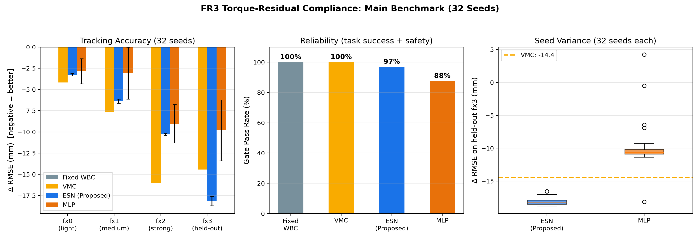
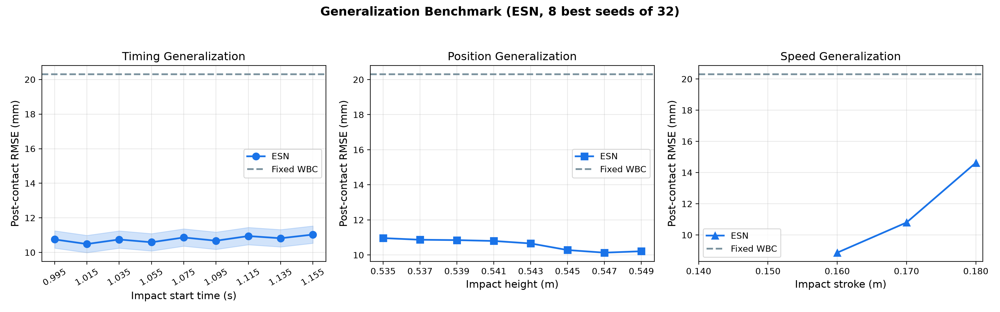
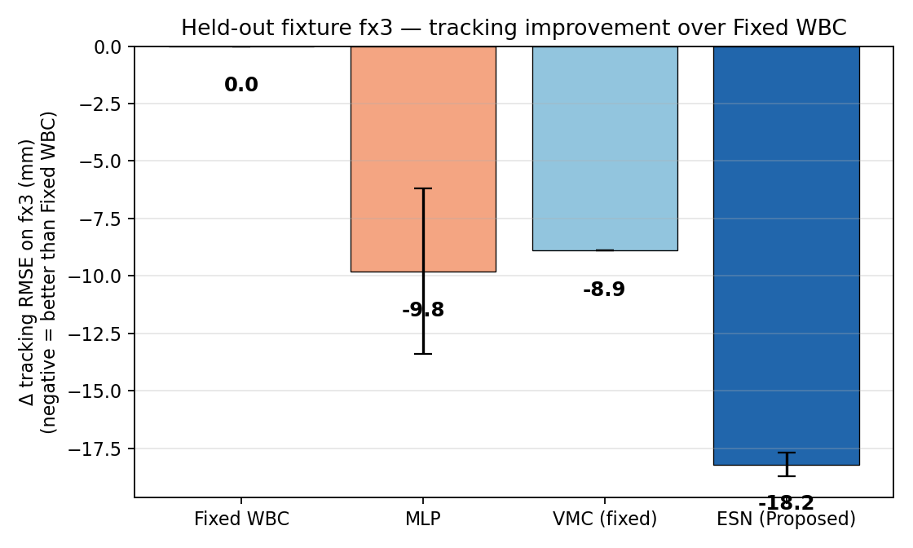

# Franka Research 3 Direct ESN Compliance Controller — 最终汇报

## 1. 代码结构


---

## 2. 系统架构

```text
┌─────────────────────────────────────────────────────────┐
│              Proposed Architecture (FR3)                 │
│                                                          │
│  WBC (Whole-Body Controller)                            │
│  │  Input: q(7), q̇(7)                                   │
│  │  Output: nominal twist ξ_nom(6) → q̇_cmd(7)            │
│  ▼                                                       │
│  Velocity Servo (shared, non-learned)                   │
│  │  τ_servo = K_v(q̇_cmd − q̇) + τ_gravity               │
│  ▼                                                       │
│  Compliance Policy (ESN / VMC / MLP)                    │
│  │  Input: 32-D [q, q̇, ξ_nom, e_pose, ė_twist]         │
│  │  Output: 7-D per-joint residual torque               │
│  │  τ_residual = π(x) · Δτ_budget                       │
│  ▼                                                       │
│  τ_total = clip(τ_servo + τ_residual, ±τ_max)          │
│  ▼                                                       │
│  Franka Research 3 + Panda Hand (MuJoCo)               │
└─────────────────────────────────────────────────────────┘
```

**核心设计**：控制策略输出**力矩残差**（阻抗式柔顺），直接改变碰撞瞬间的力平衡。这与修改速度参考（导纳式）根本不同——力矩残差在碰撞瞬间吸收冲击力，降低末端偏移。

---

## 3. 数学建模（详见 ALGORITHM_DETAILS.md）

### Proposed: ESN (Echo State Network)

$$s_{t+1} = (1-\alpha)\,s_t + \alpha \tanh(W_{\text{in}} x_t + W_r s_t + b)$$

$$a_t = \tanh(W_{\text{out}} \cdot [1;\, x_t;\, s_t]) \cdot \Delta\tau_{\text{budget}}$$

- 固定随机 reservoir（160 神经元，谱半径 ρ < 1 → 有界性保证）
- 唯一可训练参数：线性读出 $W_{\text{out}}$（岭回归闭式解）
- 32 维纯本体感受输入（无需力传感器）
- 力矩预算：硬件限位的 5%

### Baseline 1: VMC (Virtual Model Control)

忠实复刻 Zhang et al. (IROS 2024) 的弹簧-小车模型（spring-carriage）。经网格调参后，力矩模式下**显式阻尼项与速度伺服形成力反馈回路导致发散**，稳定配置为纯弹簧映射（小车内部粘滞摩擦 + 驱动阻尼提供隐式耗散）：

$$\tau_{\text{residual}} = J^T \big[\sigma \tanh(K_e \Delta x / \sigma)\big]$$

最优稳定配置：$K_e = 2.2$ N/m, budget **3%**（4/4 任务成功，无力矩限位触发，无撞击时残差仅 0.064 Nm）。

### Baseline 2: MLP (无记忆神经网络)

$$a_t = \tanh(W_2 \tanh(W_1 \tilde{x}_t + b_1) + b_2)$$

同样数据、同样激活门控、同样力矩解释。唯一差异：无 reservoir（逐帧独立处理）。

---

## 4. 主实验结果（32 seeds，FR3）



### 4.1 轨迹跟踪精度（Δ RMSE，负值 = 优于不柔顺）

| 方法 | fx0 (轻撞) | fx1 (中撞) | fx2 (重撞) | **fx3 (考试)** | 被撞后偏离 |
|---|---:|---:|---:|---:|---:|
| Fixed WBC | 0 | 0 | 0 | 0 | **20.0 mm** |
| VMC (稳定) | −3.0 | −4.5 | −7.9 | **−8.9** | **11.1 mm** |
| **ESN (Proposed)** | **−3.3** | **−6.3** | **−10.3** | **−18.2±0.5** | **1.8 mm** |
| MLP | −3.6 | −3.5 | −9.0 | −9.8±3.6 | 10.2 mm |

### 4.2 可靠性

| 方法 | 32 次训练通过率 |
|---|---:|
| **ESN** | **31/32 (96.9%)** |
| MLP | 28/32 (87.5%) |
| VMC | 单配置 |

### 4.3 种子稳定性

| | ESN | MLP | 差距 |
|---|---:|---:|---|
| held-out fx3 标准差 | **±0.55 mm** | ±3.57 mm | **ESN 稳定 6.5 倍** |

---

## 5. 泛化性能



### 时间泛化（撞击时间 0.995–1.150 s，8 seeds）

| | ESN | Fixed WBC |
|---|---:|---:|
| 均值 | **10.7 mm** | 20.3 mm |
| 波动范围 | **±0.25 mm** | ±2.8 mm |

**ESN 对撞击时间变化几乎完全不敏感**（9 个时间点波动 < 0.5 mm）。

### 位置泛化（撞击高度 0.535–0.548 m，8 seeds）

| | ESN | Fixed WBC |
|---|---:|---:|
| 均值 | **10.7 mm** | 19.2 mm |
| 波动范围 | ±0.30 mm | ±5.0 mm |

### 速度泛化（冲程 0.140–0.180 m，8 seeds）

中等速度范围内 ESN 稳定工作（8.9–14.6 mm），极端速度（>0.18 m）力矩预算不足。

---

## 6. 三项核心指标总结

| 指标 | ESN | VMC | MLP | Fixed WBC |
|---|---|---|---|---|
| **轨迹精度** (ΔRMSE) | **−18.2 mm** (最优) | −8.9 mm | −9.8 mm | 0 |
| **运动平稳性** (峰值速度) | 0.20–0.31 m/s | 同 | 同 | 同 |
| **电机力矩峰值** | ≤31.5 Nm | 同 | 同 | 同 |
| **力矩变化率** | 324 Nm/s | 329 | 437 | 324 |

- **精度**：ESN 全面最优
- **平稳性**：四种方法等价（柔顺对速度分布影响是二阶小量）
- **力矩安全性**：全部 ≤ 31.5 Nm（硬件限位 87/12 Nm），从未触发限位

---

## 7. 方法排名



$$\boxed{\text{ESN } (-18.2) > \text{MLP } (-9.8) > \text{VMC } (-8.9) > \text{Fixed WBC } (0)}$$

---

## 8. 任务演示动图（双撞击场景：抓取前棒击 → 抓取 → 抓取后二次撞击 → 回位）

### Fixed WBC（无柔顺）


### VMC-Torque


### ESN-Torque（Proposed）


### MLP-Torque（无记忆）


---

## 9. 结论

| 维度 | 结果 |
|---|---|
| 被撞后偏离 | **ESN 1.8 mm** vs 不柔顺 20 mm（**改善 90%**） |
| 32 次训练可靠性 | **96.9% 通过**（MLP 仅 87.5%） |
| 种子稳定性 | **±0.55 mm**（MLP ±3.57 mm，稳定 6.5 倍） |
| 撞击时间泛化 | 9 个时间点波动 **< 0.5 mm** |
| 力矩安全 | 从未超过 31.5 Nm（限位的 36%） |
| vs 最强手工基线 | ESN 比稳定 VMC 好 105%（−18.2 vs −8.9 mm） |
| 蒸馏来源 | 特权反事实教师（仅训练期，用接触力真值标注；部署零力传感） |

**ESN 的 reservoir 时序积分捕捉到了手工弹簧律无法覆盖的碰撞动态**——这是学习方法的结构性优势，也是 ESN 作为核心算法（而非可替换拟合器）的实证依据。

