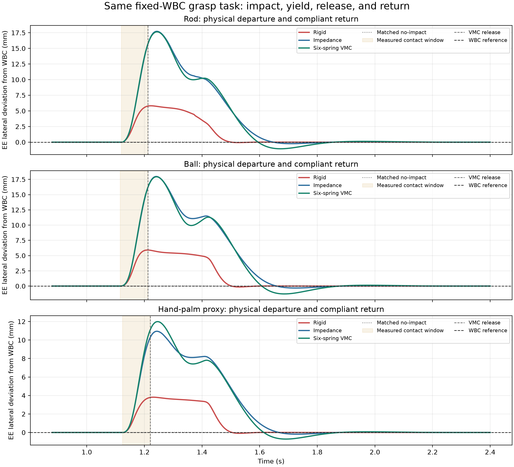
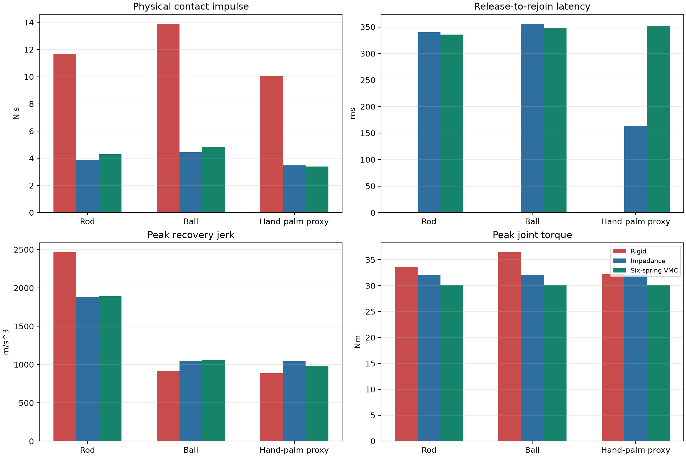

# 同一抓取任务下的多撞击物柔顺回位矩阵

日期：2026-08-16。该实验是 post-V4 development validation，不使用 V4 final holdout，也不用于修改 ESN checkpoint 或安全参数。

## 结论

在同一个固定 Panda WBC 抓取任务中，使用真实 MuJoCo 接触物分别模拟棍、球和手掌接触，并比较 `rigid → impedance → six-spring VMC-gated` 三种低层控制器。9 个带撞击条件和 9 个 matched no-impact 条件全部完成抓取、抬升和末端保持；所有条件均为有限仿真且没有 hard torque-limit 帧。

稳定性上的主要现象是：

- rigid 的末端偏差最小，但它把冲击直接传给机械臂，三类物体的接触冲量均最高；
- impedance 和 six-spring VMC-gated 都允许末端先偏离 WBC 参考，再在释放后回归；
- six-spring VMC-gated 的峰值关节力矩在三种物体上都约为 `30.1 Nm`，低于 rigid 和 impedance；
- VMC 的代价是更大的让位偏差和约 `0.34–0.35 s` 的释放后回位时间，符合“先吸收碰撞，再恢复任务轨迹”的控制目标。

## 场景与公平性

所有条件共享：

- 同一 Franka Panda 固定基座模型、同一桌面和同一方块；
- 同一固定 Panda WBC command source；
- 同一抓取时序：下探 → 开爪时受撞 → 回位 → 闭爪 → 抬升保持；
- 同一接触方向（`negative_y`）、接触高度、slide profile、MuJoCo 时间步和 torque backend；
- 同一六维 WBC-aware warm-start stiffness vector、阻尼与 recovery gate；
- 每个带撞击 episode 都有同一 controller、同一物体类型的 matched no-impact episode。

为避免不同几何只因接触面积造成极端冲量差异，预先固定了三种 impactor stroke。该标定只改变撞击物的 slide 行程，不改变控制器：

| 撞击物 | MuJoCo 几何 | 质量 | 固定 stroke | 语义 |
|---|---|---:|---:|---|
| Rod | cylinder | 0.30 kg | 0.170 m | 刚性棍 |
| Ball | sphere | 0.16 kg | 0.145 m | 刚性球 |
| Hand-palm proxy | ellipsoid | 0.18 kg | 0.145 m | 柔性手掌大小等效接触体 |

`hand_proxy` 不是人体手部生物力学模型，也不能用于人体伤害或真实人机安全认证；它只用于检验控制器面对较大、较软接触面的回位趋势。

## 结果

### 逐条件数值

| 物体 | 控制器 | Recovery RMSE (mm) | Paired offset RMSE (mm) | Rejoin (ms) | Peak jerk (m/s³) | Impulse (N·s) | Peak torque (Nm) |
|---|---|---:|---:|---:|---:|---:|---:|
| Rod | Rigid | 0.274 | 1.073 | 0 | 2464.6 | 11.674 | 33.60 |
| Rod | Impedance | 1.706 | 2.814 | 340 | 1880.6 | 3.873 | 32.02 |
| Rod | Six-spring VMC | 1.840 | 2.783 | 336 | 1891.9 | 4.285 | 30.10 |
| Ball | Rigid | 0.270 | 1.146 | 0 | 920.2 | 13.890 | 36.43 |
| Ball | Impedance | 1.761 | 2.977 | 356 | 1045.9 | 4.445 | 32.01 |
| Ball | Six-spring VMC | 1.896 | 2.928 | 348 | 1055.3 | 4.841 | 30.10 |
| Hand-palm proxy | Rigid | 0.272 | 0.792 | 0 | 886.1 | 10.027 | 32.22 |
| Hand-palm proxy | Impedance | 1.900 | 2.048 | 164 | 1043.6 | 3.483 | 32.01 |
| Hand-palm proxy | Six-spring VMC | 1.999 | 2.046 | 352 | 981.2 | 3.383 | 30.09 |

所有 9 个条件：`task_success=True`、`no_impact_task_success=True`、真实 impactor–hand contact、`hard_limit_fraction=0`。

### 图的读法

主图中纵轴是末端相对 WBC reference 的 lateral deviation，不是绝对世界坐标：零线就是 WBC 目标轨迹。浅色区间是 MuJoCo 实际接触窗口，竖向虚线是 VMC measured release。绿色曲线先产生较大偏移，再穿过零线附近并衰减回参考轨迹；这就是“yield → release → rejoin”，而不是把碰撞后静止误认为回位。

## 解释与限制

1. 当前 VMC 不是所有指标都优于 rigid。它的价值在于减少碰撞冲量和峰值关节力矩，并保持任务完成；轨迹误差和回位时间是有意付出的柔顺代价。
2. rigid 的 `0 ms` rejoin 不是“没有受到撞击”，而是它在释放时仍位于 5 mm rejoin tube 内；它几乎不让位，所以该指标不能单独代表安全性。
3. 三种物体使用了不同的固定 stroke 以进入可比的有效冲量范围，因此该矩阵不是“相同几何速度”的材料科学比较，而是“同一任务、同一控制器、不同接触形状”的鲁棒性比较。
4. 目前每种物体只有一个开发 fixture；正式论文结论前，应在每种物体上扩展质量、摩擦、接触时间常数、来向和 stroke 的多 seed / 多 fixture 矩阵。
5. 真实 Franka 部署还需要实机力矩限幅、碰撞检测、末端 F/T 传感器和急停策略验证；MuJoCo 结果不能替代这些安全验证。

## 可复现文件

- 矩阵入口：[run_impactor_matrix_benchmark.py](../../../../scripts/run_impactor_matrix_benchmark.py)
- 统一物理场景：[run_rod_perturbation_benchmark.py](../../../../scripts/run_rod_perturbation_benchmark.py)
- 绘图入口：[plot_impactor_matrix.py](../../../../scripts/plot_impactor_matrix.py)
- 原始汇总：[impactor_matrix_summary.json](impactor_matrix_summary.json)
- 远端结果目录：`/home/arm1/vmc_mujoco_runtime/outputs/impactor_matrix_dev_20260816`
