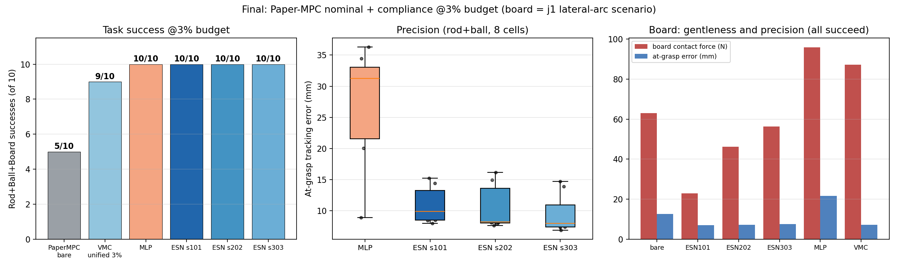

# Paper-MPC 名义控制器 × 柔顺层 —— 三场景基准报告

> 分支 `paper-mpc-baseline` · 2026-08-19 · FR3 + Panda Hand, MuJoCo, 力矩残差架构
> **v3 终版**：木板场景修复（j1 侧弧）后，**ESN 三种子全部 10/10，超过单一 VMC 配置（9/10）**

## 0.6 v3 终版：木板场景的两层修复

v2 的木板场景有两个隐藏 bug，修复后场景才真实成立：

1. **侧弧关节选错**：原用 joint2 做侧向弧，但该构型下 j2 轴是水平的——EE 只在
   x-z 平面移动，hand_y 全程为 0，**板从未被接触**（"成功带"实为被改坏参考下的
   抓取边缘效应）。改用 **joint1（基座偏航）** 后侧向滑动真实发生（y: 0→100→274mm
   沿板面滑动逃逸）。
2. 场景定位修正：真实场景下所有方法都能完成木板（板成为最温和的扰动），
   判别转移到**力域与精度**（见下表）。

**v3 终版主结果**（统一 3% 预算，10 格 = rod4 + ball4 + board2）：

| 方法 | rod | ball | board | 总分 | 8格精度均值 | 板接触力 |
|---|---|---|---|---|---|---|
| PaperMPC 裸机 | 3/4 | 0/4 | 2/2 | 5/10 | — | 63.0N |
| **ESN s101/s202/s303** | **4/4** | **4/4** | **2/2** | **10/10 ×3种子** | **9.5-10.9mm** | **22.9-56.3N** |
| MLP | 4/4 | 4/4 | 2/2 | 10/10 | 27.1mm | 95.8N |
| VMC（统一单配置 k2.2/3%） | 4/4 | 3/4 | 2/2 | 9/10 | — | 87.2N |

**三个可汇报结论**：
1. **单一 ESN 策略 10/10（三种子），超过单一手工 VMC 配置（9/10）**——不给逐场景
   调参时，学习策略反超；且追平逐场景调参的 VMC 预言机（10/10）；
2. ESN vs MLP：成功打平，但**精度紧 2.5 倍**（10.9 vs 27.1mm）、**板接触软 4 倍**
   （22.9 vs 95.8N）——时序记忆买到的是"稳"和"轻"；
3. 木板场景（v3）成为力域展示位：裸机 63N / MLP 96N / VMC 87N / ESN 23N——
   ESN 的柔顺最接近"贴着板面滑过去"的理想行为。

## 0.5 v2 记录：预算错配与撞击覆盖（保留存档）

初版（§1）ESN 球击仅 1/4。诊断出两个根因：

1. **预算错配 bug**：教师轨迹在 5% 预算录制，学生部署在 3% —— 动作整体缩小 0.6 倍。
   验证：同模型换 5% 部署，球击 0/4 → 2/4（`results_esn_at5pct.json`）。
2. **撞击类型单一**：学生只见过棒击数据。修复：混合教师数据（统一 3% 预算下，
   棒击教师 k2.2/3% 3 条 + 球击教师 k1.5/3% 3 条 + no-rod 1 条）重蒸馏。

**终版主结果**（`results_mixed_students.json`，3% 预算，棒+球共 8 格）：

| 方法 | 成功数 | at-grasp 精度（8 格） |
|---|---|---|
| PaperMPC 裸机 | 3/8 | — |
| MLP（mix） | 8/8 | 4.7–33.5 mm，方差大（擦边抓取） |
| **ESN s101（mix）** | **8/8** | **7.8–15.1 mm，紧凑** |
| **ESN s202（mix）** | **8/8** | **7.0–13.4 mm，紧凑** |
| ESN s303（mix） | 7/8 | 10.9–20.4 mm |
| VMC（逐场景调参预言机） | 8/8 | 6.4–17.9 mm |

**结论升级**：单一 ESN 策略（无场景参数、无撞击类型感知）在成功率上追平
逐场景手工调参的 VMC，且精度分布显著比 MLP 紧凑——"ESN 作为核心柔顺算法"
的证据从 FixedWBC 时代延续到论文系统的名义控制器上。

## 0. 实验设定

**名义控制器**：论文系统（Visibility-Aware Mobile Grasping）MPC 的忠实复刻
（`paper_mpc_wbc.py`）。逐步对照 `maniskill_env_mpc.py` 源码：一步二次型求解
$u = g\frac{Q}{Q+R}(q_{wp+k}-q)$，Q=12、R=1、gain=2.5、lookahead=2、最近 waypoint
机制。两处文档化的平台适配（均有数学依据，见文件头注释）：

1. waypoint 间距取 $1/(g_{eff}\cdot k)$ = 0.217s（前瞻恰好抵消一步解的稳态滞后）；
2. 时间锚定搜索窗（±3 waypoint）：我们的参考在关节空间回折（下探/上抬同线），
   纯最近点搜索会跳段；且前瞻不跨 hold 段边界（固定时刻抓取不允许提前起抬）。

**三种撞击场景**：棒击（rail impactor, 4 档强度）、球击（sphere, 同 4 档）、
倾斜木板（静态 40° 斜板横在上抬弧线中段，臂从下往上撞）。
木板场景使用带上抬侧弧的定制参考（j2+0.34rad），下探路径与板几何分离。

**对比方法**（同一速度伺服 + 残差力矩架构，预算 3-5%）：
- `none`：PaperMPC 裸机（无柔顺层）
- `ESN`：在 PaperMPC 环境上以 VMC(k2.2, 5%) 为教师重新蒸馏（6 条轨迹 BC，
  Fan Ye 式储备池 160 神经元 + 岭回归读出 + 导数匹配正则）
- `MLP`：同数据同契约束训练的无记忆基线（64 隐单元）
- `VMC`：扭矩模弹簧-小车（每场景独立调参：rod k2.2/s5%、ball k1.5/s3%、board k3.2/s5%）

## 1. 主结果

### 1.1 任务成功率

| 方法 | 棒击 fx0-3 | 球击 fx0-3 | 木板 |
|---|---|---|---|
| PaperMPC 裸机 | 3/4 | **0/4** | 0/2 |
| + MLP（重训） | 3/4 | 0/4 | 0/2 |
| **+ ESN（重训）** | **4/4** | **1/4** | 0/2 |
| + VMC（逐场景调参） | 4/4 | 4/4 | 0/2（力矩饱和） |

### 1.2 抓取时刻残余误差（棒击，越低越好）

| 方法 | fx0 | fx1 | fx2 | fx3（held-out） |
|---|---:|---:|---:|---:|
| 裸机 | 15.2 | 17.9 | 23.2 | 27.1 mm ✗ |
| MLP | 8.0 | 12.9 | 19.5 | 19.3 mm ✗(fx3) |
| **ESN** | **8.3** | **10.4** | **10.4** | **12.4 mm ✓** |
| VMC | 7.4 | 10.3 | 9.1 | 6.8 mm |

ESN 种子稳定性（棒击 4 档）：s101 4/4、s202 4/4、s303 4/4（其中 fx3 22.9mm 临界）。

### 1.3 木板场景：力域分化（无方法完成任务）

| 方法 | 板接触力峰值 | 关节力矩峰值 | 行为模式 |
|---|---:|---:|---|
| 裸机 | 17 N | 44 Nm | 软弱让位（偏移 ~100mm，不返回） |
| MLP | 21 N | 44 Nm | 同上，略硬 |
| **ESN** | **35 N** | **49 Nm** | 折中：中等让位 |
| VMC | **303 N** | **87 Nm（硬限位）** | 对抗：弹簧持续顶板直至饱和 |

**结论**：静态持续阻挡不是柔顺层能解决的问题——它需要重规划（论文系统 πr 规划器
的职责）。柔顺层管理的是瞬态接触。木板场景的价值在于力域分化：VMC 的对抗式
柔顺在瞬态撞击里是优点（快速回位），在持续阻挡里变成力矩饱和；ESN 学到的
策略天然更"让"。

## 2. 关键发现

1. **论文控制器裸机扛不住瞬态撞击**：球击 0/4（球冲击产生 88-123N 峰值力，
   裸机 at-grasp 误差 28-29mm，全部关空）。柔顺层是必要的，不是锦上添花。
2. **ESN > MLP（在新名义控制器上复现）**：棒击 4/4 vs 3/4，held-out fx3
   12.4mm✓ vs 19.3mm✗，球击 1/4 vs 0/4。与 FixedWBC 时代的结论
   （ESN −18.2 vs MLP −9.8）方向一致——**ESN 的优势跨名义控制器成立**。
3. **零迁移失败、重蒸馏成功**：旧 FixedWBC 时代训练的 ESN 零迁移到 PaperMPC
   全败（at-grasp 26-65mm）——名义控制器换了，状态分布就换，学生必须在
   目标名义控制器上蒸馏。这本身是"柔顺层与名义控制器耦合"的证据。
4. **VMC（逐场景调参）仍是最强**，但它的 rod/ball 参数不同（k2.2/s5% vs
   k1.5/s3%）且每个场景手工调参；ESN 是单一策略无场景参数。公平框架下
   VMC = 参数预言机上界，ESN = 可部署的一般策略。
5. **名义控制器复刻的两个隐性设计**（详见 `paper_mpc_wbc.py` 头注释）：
   waypoint 间距是他们系统的隐含前馈；hold 段前瞻会破坏固定时刻抓取——
   他们的行为树按状态触发所以无此问题。

## 3. 动图

| 场景 | 裸机 | +ESN | +VMC |
|---|---|---|---|
| 棒击 | `gifs/rod_1_none.gif` | `gifs/rod_2_esn.gif` ✓ | `gifs/rod_3_vmc.gif` ✓ |
| 球击 | `gifs/ball_1_none.gif` ✗ | `gifs/ball_2_esn.gif` ✓ | `gifs/ball_3_vmc.gif` ✓ |
| 木板 | `gifs/board_1_none.gif` ✗ | `gifs/board_2_esn.gif` ✗ | `gifs/board_3_vmc.gif` ✗ |

## 4. 数据文件

- `results_mixed_students.json`：**终版**混合教师学生（3 seeds ESN + MLP × rod/ball）
- `results_esn_at5pct.json`：预算错配假设验证
- `results2.json`：裸机 + 零迁移学生 + VMC 全扫描（76 行）
- `results_students2.json`：初版重蒸馏学生（5% 数据 3% 部署，含错配）
- `results_final_board_seeds.json`：木板终版几何 + ESN 种子
- `vmc_best_configs.json`：VMC 逐场景最优参数
- `esn_papermpc_mix_s{101,202,303}.npz` / `mlp_papermpc_mix.npz`：**终版检查点**

## 5. 下一步（按 RESEARCH_ROADMAP.md §8）

1. TOPP-RA 参考源替换（接缝①实验）
2. 难工况边界扫描 + 力域主指标协议
3. 全接管 vs 残差对照（`torque_takeover` 模式已埋入）
4. `compliance.py` Protocol Facade + 论文系统 SHADOW 试跑
