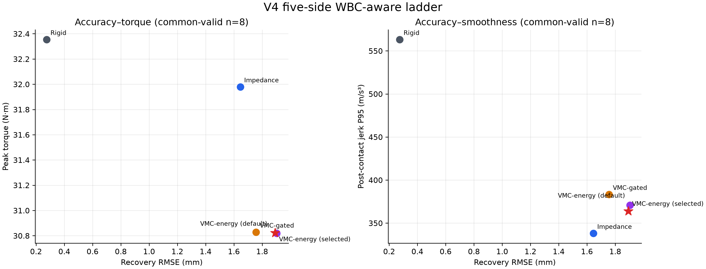

# Fixed-Panda-WBC Aware V4 Ladder

## 结论

在同一套固定 Panda WBC command source、同一套 V4 五侧向实体 rod fixture、同一 torque backend 和同一有效性门槛下，完成了 `rigid → impedance → VMC-gated → VMC-energy` 的公平 ladder，并额外运行了预先冻结的 selected `slow_smoothing` VMC-energy。

`impedance`、`VMC-gated`、default VMC-energy 和 selected VMC-energy 全部为 **10/10 valid**；`rigid` 为 **8/10 valid**。五种方法的数值比较只使用它们共同有效的 **8 个 fixture**。因此，Panda WBC 闭环没有破坏 VMC 的抓取、让位和回归可行性，且 VMC 继续显著降低 torque-rate；但 rigid 仍然具有最低 recovery RMSE，impedance 仍然具有最低 jerk，不能声称 VMC 全面支配解析 baseline。

## 1. 这次到底固定了什么

原 V4 的物理几何、rod timing 和碰撞门槛全部原样使用：`−x`、`+x`、`−y`、`+y`、`−z` 五个 axis-aligned 实体接近侧面，共 10 个 fixture。唯一替换的是 nominal command 的来源：每个 controller 都使用同一个 `fixed_panda_wbc` source。

```text
fixed pick/lift target → FixedBasePandaWBC → pose/twist/qdot WBC command
                       → rigid / impedance / VMC low-level torque execution
```

WBC adapter 是 fixed-base Panda 的每周期 resolved-rate task-priority controller，带 null-space posture、task/joint speed bound；VMC 只能 compliant-execute WBC command，不能修改 WBC target generation。这一 run 的每个 ladder JSON 都记录：

```json
"reference_source": "fixed_panda_wbc"
```

## 2. 重要的 scope 限制

这是对**已经冻结的 V4 fixture**进行的 WBC-aware realization，不是 ESN 的独立最终 test：V4 的几何/timing 曾用于先前的 proxy-reference benchmark。当前结果的用途是证明 WBC command boundary 与解析 baseline 可以闭环工作，并确定 ESN 将要面对的 strongest analytic baselines。

它不能用于：

- 在这些 fixture 上再调 WBC、VMC stiffness 或 safety config；
- 声称这是 ESN 的独立 holdout；
- 将五侧向结果说成 `±x/±y/±z` sign-complete 或 arbitrary continuous 3-D collision。

正式 ESN 训练后应保留 V2/V3/V4，不在这些 fixture 上进行 ESN hyperparameter / safety threshold 选择。

## 3. 有效率

| 方法 | Valid / attempted | 说明 |
|---|---:|---|
| Rigid | 8 / 10 | `positive_x_c1_t1` 与 `negative_z_c4_t1` 未通过完整有效性门槛 |
| Impedance | 10 / 10 | 全有效 |
| VMC-gated | 10 / 10 | 全有效 |
| VMC-energy (default) | 10 / 10 | 全有效 |
| VMC-energy (selected) | 10 / 10 | 全有效 |

Rigid 的两次失败被保留在 validity rate 中。它们不进入 common-valid 平均，避免将一个对其他方法无对应的失效 sample 用于数值比较。

## 4. 主结果：common-valid n=8

| 方法 | Recovery RMSE ↓ | Rejoin latency ↓ | Jerk P95 ↓ | Peak torque ↓ | Torque-rate peak ↓ | Peak contact force ↓ | Contact impulse ↓ |
|---|---:|---:|---:|---:|---:|---:|---:|
| Rigid | **0.275 mm** | **0.001 s** | 563.176 m/s³ | 32.354 N·m | 613.521 N·m/s | 48.708 N | 7.877 N·s |
| Impedance | 1.646 mm | 0.222 s | **338.044 m/s³** | 31.979 N·m | 271.262 N·m/s | **38.542 N** | 3.061 N·s |
| VMC-gated | 1.756 mm | 0.218 s | 383.256 m/s³ | 30.828 N·m | **97.514 N·m/s** | 38.941 N | 3.047 N·s |
| VMC-energy default | 1.904 mm | 0.242 s | 370.672 m/s³ | **30.818 N·m** | 97.545 N·m/s | 38.918 N | 3.002 N·s |
| VMC-energy selected | 1.892 mm | 0.232 s | 363.833 m/s³ | 30.823 N·m | 97.549 N·m/s | 38.899 N | **2.988 N·s** |



### 可支持的结论

1. **WBC-aware VMC 仍然是有效的柔顺 baseline。** 所有 VMC 变体在 10 个 WBC-driven physical fixture 上都有效，并完成 rod contact 后的 lift/hold task。
2. **VMC 的强优势是降低 torque-rate。** selected VMC-energy 相比 rigid 低 84.10%，相比 impedance 低 64.04%；同时其 contact impulse 相比 rigid 低约 62.1%。代价是 recovery RMSE 更大。
3. **VMC-gated 是主要的解析 accuracy/rejoin baseline。** 它在 VMC 家族中 recovery RMSE 最低（1.756 mm）且 rejoin 最快（0.218 s）。
4. **selected safety config 在 WBC-aware setting 中相对 default 有小而一致的改善。** RMSE `1.904 → 1.892 mm`（−0.61%）、rejoin latency `0.242 → 0.232 s`（−4.13%）、jerk `370.672 → 363.833 m/s³`（−1.85%）、contact impulse `3.002 → 2.988 N·s`（−0.47%）；peak torque 与 torque-rate 基本持平。因此它可保留为 safety ablation，但仍不是对所有 VMC 变体的全面支配者。
5. **不能写“VMC 全方面优于 impedance”。** selected VMC-energy 的 RMSE 比 impedance 高约 14.99%，jerk 高约 7.63%，但 torque-rate 显著更低。结果依旧是精度、平稳性和执行器安全之间的 Pareto relation。

## 5. 对 ESN baseline 的决定

后续 proposed ESN 必须至少对比以下两条解析线：

- **WBC + VMC-gated**：当前更强的 accuracy/rejoin analytic baseline；
- **WBC + selected VMC-energy**：当前更强的 safety-filter analytic ablation。

ESN 的候选输出需要与它们共享同一 WBC command boundary、torque feasibility scaling、slew limiter 和 fixture protocol。其 student input 只能使用 Panda 的 `q`、`qdot`、`wbc_task_twist` 及内部历史；rod/contact 诊断仅允许作为 teacher/evaluation 信息。

## 6. 可复现文件

- ladder runner：[`scripts/run_benchmark_v2_ladder.py`](../../scripts/run_benchmark_v2_ladder.py)
- WBC adapter：[`scripts/fixed_panda_wbc.py`](../../scripts/fixed_panda_wbc.py)
- comparison builder：[`scripts/compare_v4_final_holdout.py`](../../scripts/compare_v4_final_holdout.py)
- default ladder raw rows：[benchmark_v2_ladder.csv](default/benchmark_v2_ladder.csv)
- selected ladder raw rows：[benchmark_v2_ladder.csv](selected/benchmark_v2_ladder.csv)
- merged comparison：[wbc_aware_v4_comparison.json](wbc_aware_v4_comparison.json)
