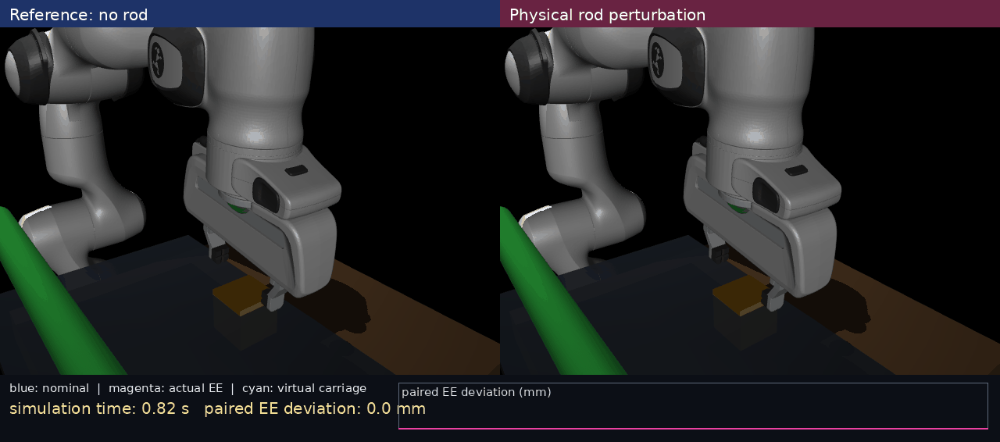

# Fixed-base Panda WBC → VMC 接口与 MuJoCo Demo

## 结论

本目录新增了一个可运行的 **fixed-base Panda WBC command adapter**，并在 MuJoCo 中验证其可完成完整链条：固定 WBC 下探 → 有限质量 rod 实体撞击手部 → VMC-gated 让位与回归 → 夹爪闭合 → 物块抬起并保持。

这不是把现有的 Fetch/ManiSkill whole-body stack 直接搬到 Panda 上。那个工程使用 Fetch 的 11-DoF base/torso/arm 状态和另一套仿真栈，不能与 Panda 的 7-DoF torque-level MuJoCo 场景直接混接。本实现建立的是 Panda 侧可替换的 command boundary；今后真实 WBC 只需实现同一输出 contract。



## 1. 不可绕过的控制边界

```text
fixed high-level SE(3) pick/lift target generator
                 │
                 ▼
  FixedBasePandaWBC (resolved-rate, task priority, null-space posture)
                 │ emits target pose, task twist, qdot_WBC
                 ▼
        VMC-gated low-level compliance torque layer
                 │ bounded virtual wrench + torque feasibility + slew limit
                 ▼
             Panda MuJoCo torque actuators
```

WBC 每个控制周期读取 Panda 的 `q` 与当前末端 pose，只根据预先固定的 SE(3) pick/lift target 生成：

\[
\dot x^{\mathrm{WBC}}
=
\dot x^{\mathrm{ff}}
+K_p(x^{\star}-x)
+K_R\,\mathrm{Log}(R^{\star}R^\top),
\]

\[
\dot q^{\mathrm{WBC}}
=J_\lambda^\#\dot x^{\mathrm{WBC}}
+(I-J_\lambda^\#J)K_N(q_0-q).
\]

其中伪逆使用 damped least squares，并对 task speed、joint speed 和低层 torque slew 全部限幅。VMC 不改变 (x^{\star})、高层任务阶段或 WBC target-generation policy；它只把已给出的 WBC pose/twist 作为顺应执行的 nominal command。

## 2. 信息边界

WBC 和低层 VMC 都不读取：rod state、contact flag、contact force、obstacle pose/velocity，或未来 release time。接触信息仅用于 MuJoCo 离线评估、phase 标注和 validity gate。

此次 demo 的 VMC-gated return drive 仅由当前 nominal–actual end-effector position error 和内部 causal hold state 决定，因此与以后 ESN 的 proprioceptive deployment setting 不冲突。

## 3. 可运行 demo

命令：

```bash
export MUJOCO_GL=egl
python scripts/run_fixed_wbc_vmc_demo.py \
  --menagerie /path/to/mujoco_menagerie \
  --output-dir outputs/fixed_wbc_vmc_demo
```

固定物理场景为 `negative_y` rod approach、0.170 m stroke、0.995 s rod start、显式 3-DoF translational virtual carriage、冻结的 6D stiffness vector 与 VMC-gated low-level layer。脚本自动运行同一个 WBC task 的 rod/no-rod pair，并生成左右对照 GIF。

| 量 | 结果 |
|---|---:|
| rod–hand physical contact | 是 |
| primary contact start | 1.160 s |
| stable trajectory-tube rejoin | 1.548 s |
| release-to-rejoin latency | 0.296 s |
| secondary physical contact | 1 次（1.336–1.448 s，显式保留） |
| target lifted | 是 |
| target held at episode end | 是 |
| hard torque-limit fraction | 0 |
| max rod penetration | 3.882 mm |

必须注意：物理 rod 在第一次短暂卸载后仍完成一次第二接触；因此 stable rejoin 是在完整接触序列后测得，而不是把第一次 release 错当作最终安全恢复。该事件被完整记录在 summary 与 phase analysis 中。

## 4. 产生的接口数据

每个 trace 除原先的 `nominal_position` / `nominal_twist` 外，新增：

- `wbc_task_twist`：经 WBC DLS、null-space 和限速后的实际 task command；
- `wbc_joint_velocity`：7 维 fixed-WBC joint-velocity command；
- `wbc_position_error`、`wbc_orientation_error`：WBC 自身相对其 fixed target 的反馈误差；
- summary 中的 `wbc_interface`：source、信息边界和模块职责。

这使后续 ESN 可以明确读取 `q`、`qdot` 和 `wbc_task_twist` 历史，而不需要从 benchmark 的 rod diagnostics 中偷看接触真值。

## 5. 当前 scope 与下一步

本版本是**固定底座 Panda 的 resolved-rate WBC**，不应伪称为 Fetch 的 mobile whole-body controller，也不是完整真实硬件验证。它已经提供正式 WBC+ESN 所需的机器人无关接口：任何后续 WBC 只要逐周期发布 `(target SE(3), task twist, joint velocity)`，即可替换该 adapter，而不修改 VMC、ESN 或 benchmark 评估代码。

下一步是将 `reference_source=fixed_panda_wbc` 扩展为 ladder 的固定选项，并在独立 ESN train/validation fixtures 上训练只读取本体感觉历史的 student；冻结 V2/V3/V4 holdout 仍不参与 ESN 调参。

## 6. 可复现文件

- WBC adapter：[`scripts/fixed_panda_wbc.py`](../../scripts/fixed_panda_wbc.py)
- demo runner：[`scripts/run_fixed_wbc_vmc_demo.py`](../../scripts/run_fixed_wbc_vmc_demo.py)
- WBC-enabled episode runner：[`scripts/run_rod_perturbation_benchmark.py`](../../scripts/run_rod_perturbation_benchmark.py)
- demo summary：[fixed_wbc_vmc_demo_summary.json](fixed_wbc_vmc_demo_summary.json)
- physical rod trace：[physical_rod_trace.npz](physical_rod_trace.npz)
